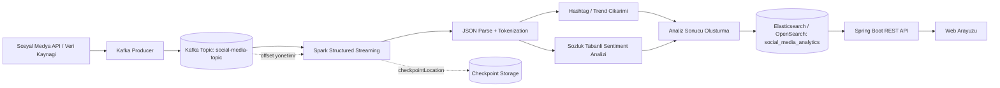

# Gercek Zamanli Analiz Motoru Mimarisi

**Proje:** Dagitik Sosyal Medya Analiz Platformu  
**Sorumlu:** Muhammet Eren Mente  
**Gorev:** Gercek zamanli analiz motoru mimarisi  
**Hafta:** 3  
**Teslim Tarihi:** 10 Mayis 2026 Pazar  
**Rapor Tarihi:** 5 Mayis 2026

## 1. Amac

Bu dokuman, Apache Spark kullanilarak gercek zamanli sosyal medya analizlerini gerceklestirecek analiz motorunun mimarisini tanimlar. Veri akisi, isleme adimlari, cikti formatlari, Spark Streaming secimi, olceklenebilirlik ve hata dayanikliligi unsurlari bu kapsamda belirlenmistir.

Mimari, projedeki `SparkStructuredStreamingJob` ve `EmrSocialMediaAnalyticsJob` siniflariyla uyumlu olacak sekilde tasarlanmistir.

## 2. Teknoloji Secimi

Analiz motoru icin Spark Structured Streaming kullanilmistir.

| Secenek | Degerlendirme |
| :--- | :--- |
| Spark Streaming | Mikro-batch temelli eski API yapisidir. RDD odakli oldugu icin bakim ve veri semasi yonetimi daha zordur. |
| Spark Structured Streaming | DataFrame/Dataset API kullanir, Kafka ve Elasticsearch entegrasyonu daha temizdir, schema tabanli veri isleme saglar. |

**Karar:** Projede Spark Structured Streaming tercih edilmistir. Bu secim, JSON mesajlarin semali okunmasi, kolon bazli transformation uygulanmasi, checkpoint ile hata durumunda devam edebilmesi ve Elasticsearch/OpenSearch sink entegrasyonu icin uygundur.

## 3. Mimari Bilesenler

| Bilesen | Gorev |
| :--- | :--- |
| Sosyal Medya Veri Kaynagi | Ham sosyal medya iceriklerini uretir |
| Kafka Producer | Gelen sosyal medya verisini `social-media-topic` topic'ine yazar |
| Apache Kafka | Gercek zamanli veri akisini kuyruklar ve offset yonetimi saglar |
| Spark Structured Streaming | Kafka'dan veriyi okur, temizler, analiz eder ve formatlar |
| Sentiment Analizi | Sozluk tabanli pozitif, negatif ve notr siniflandirma yapar |
| Hashtag/Trend Analizi | Icerikten hashtag'leri cikarir ve trend alanlarini olusturur |
| Elasticsearch/OpenSearch | Analiz edilmis veriyi `social_media_analytics` indeksinde saklar |
| Spring Boot API | Trend ve sentiment sonuclarini frontend'e sunar |
| Web Arayuzu | Analiz sonuclarini tablo/grafik olarak gosterir |

## 4. Veri Akisi

1. Sosyal medya kaynagindan gelen ham mesaj Kafka Producer tarafindan alinir.
2. Mesaj JSON formatinda `social-media-topic` topic'ine yazilir.
3. Spark Structured Streaming job'u Kafka topic'ine abone olur.
4. Kafka mesajinin `value` alani JSON olarak parse edilir.
5. Icerik temizlenir, kucuk harfe cevrilir ve token'lara ayrilir.
6. Hashtag'ler duzenli ifade ile cikarilir.
7. Pozitif ve negatif kelime sozlukleri ile sentiment skoru hesaplanir.
8. Mesaj `POSITIVE`, `NEGATIVE` veya `NEUTRAL` olarak etiketlenir.
9. Analiz sonucu `social_media_analytics` indeksine yazilir.
10. Spring Boot API ve frontend bu indeks uzerinden analiz sonuclarini goruntuler.

## 5. Veri Giris Formati

Kafka topic'ine gelen mesajlar JSON formatinda olmalidir:

```json
{
  "externalId": "post-1001",
  "platform": "twitter",
  "authorUsername": "sample_user",
  "content": "Yeni kampanya harika oldu #trend #kampanya",
  "language": "tr",
  "publishedAt": "2026-05-05T12:00:00"
}
```

| Alan | Aciklama |
| :--- | :--- |
| `externalId` | Sosyal medya iceriginin dis sistemdeki benzersiz kimligi |
| `platform` | Twitter, Instagram, TikTok vb. platform bilgisi |
| `authorUsername` | Icerigi ureten kullanici adi |
| `content` | Analiz edilecek ham metin |
| `language` | Icerik dili |
| `publishedAt` | Icerigin yayinlanma zamani |

## 6. Isleme Adimlari

| Adim | Islem | Cikti |
| :--- | :--- | :--- |
| JSON Parse | Kafka `value` alani semaya gore ayrilir | Kolonlara ayrilmis mesaj |
| Temizleme | Noktalama ve gereksiz karakterler temizlenir | `clean_text` |
| Tokenization | Metin kelime dizisine ayrilir | `tokens` |
| Hashtag Cikarimi | `#etiket` desenleri yakalanir | `hashtags` |
| Sentiment Skoru | Pozitif ve negatif kelime sayilari farki alinir | `sentiment_score` |
| Sentiment Etiketi | Skora gore siniflandirma yapilir | `sentiment_label` |
| Trend Alani | Hashtag listesi okunabilir metne cevrilir | `trend_keywords` |
| Zaman Damgasi | Isleme zamani eklenir | `processed_at` |

## 7. Cikti Formati

Analiz edilmis veri Elasticsearch/OpenSearch tarafinda `social_media_analytics` indeksine asagidaki formatta yazilir:

```json
{
  "external_id": "post-1001",
  "platform": "twitter",
  "author_username": "sample_user",
  "content": "Yeni kampanya harika oldu #trend #kampanya",
  "language": "tr",
  "tokens": ["yeni", "kampanya", "harika", "oldu", "trend", "kampanya"],
  "hashtags": ["#trend", "#kampanya"],
  "trend_keywords": "#trend,#kampanya",
  "sentiment_score": 1,
  "sentiment_label": "POSITIVE",
  "published_at": "2026-05-05T12:00:00",
  "processed_at": "2026-05-05T12:00:05"
}
```

## 8. Olceklenebilirlik

| Unsur | Aciklama |
| :--- | :--- |
| Kafka Partition | Topic partition sayisi artirilarak paralel okuma kapasitesi artirilabilir |
| Spark Executor | Spark executor sayisi artirilarak isleme kapasitesi genisletilebilir |
| Shuffle Partitions | `spark.sql.shuffle.partitions` ile dagitik islem performansi ayarlanabilir |
| Elasticsearch Shard | Indeks shard sayisi veri hacmine gore artirilabilir |
| Stateless Transformation | Tokenization ve sozluk bazli analiz stateless oldugu icin yatay olcekleme kolaydir |

## 9. Hata Dayanikliligi

| Mekanizma | Aciklama |
| :--- | :--- |
| Kafka Offset | Spark, Kafka offset bilgisiyle veri akisinda kaldigi noktayi takip eder |
| Checkpoint | `checkpointLocation` ile job yeniden basladiginda kaldigi yerden devam edebilir |
| Fail On Data Loss | EMR job tarafinda `failOnDataLoss=false` kullanilarak topic retention kaynakli kopmalar yumusatilir |
| Idempotent Sink Tasarimi | `external_id` ile tekrar yazim senaryolari kontrol edilebilir |
| Monitoring | CloudWatch veya Spark UI ile gecikme, batch suresi ve hata oranlari izlenebilir |

## 10. Calisma Modlari

| Mod | Sinif | Kullanim |
| :--- | :--- | :--- |
| Local Mode | `SparkStructuredStreamingJob` | Spring Boot uygulamasi icinde gelistirme ve yerel test |
| Cloud/EMR Mode | `EmrSocialMediaAnalyticsJob` | AWS EMR uzerinde bagimsiz `spark-submit` job'u |

Local mod, gelistirme hizini artirmak icin kullanilir. EMR modu ise uretim benzeri ortamda daha yuksek veri hacimleri icin tasarlanmistir.

## 11. Mimari Diyagram



## 12. Sonuc

Gercek zamanli analiz motoru icin Spark Structured Streaming tabanli mimari belirlenmistir. Bu mimari Kafka'dan akan sosyal medya mesajlarini okuyarak tokenization, hashtag cikarimi ve sozluk tabanli sentiment analizi uygular. Formatlanan sonuclar Elasticsearch/OpenSearch uzerindeki `social_media_analytics` indeksine yazilir ve Spring Boot API tarafindan frontend'e sunulur.

Checkpoint, Kafka offset yonetimi, yatay olceklenebilir Spark executor yapisi ve Elasticsearch shard stratejisi ile mimarinin olceklenebilir ve hata dayanikli calismasi hedeflenmistir.
