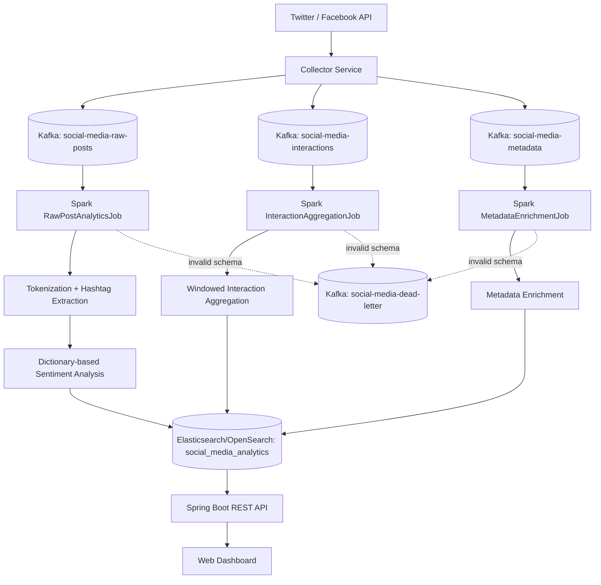

# Apache Kafka ve Apache Spark Veri Akis Mimarisi Analizi ve Topic Tasarimi

**Proje:** Dagitik Sosyal Medya Analiz Platformu  
**Sorumlu:** Muhammet Eren Mente  
**Gorev:** Apache Kafka ve Apache Spark veri akis mimarisi analizi ve topic tasarimi  
**Hafta:** 2  
**Teslim Tarihi:** 12 Mayis 2026 Sali  
**Rapor Tarihi:** 5 Mayis 2026

## 1. Amac

Bu dokuman, sosyal medya verilerinin Apache Kafka uzerinde nasil modellenecegini, Apache Spark Structured Streaming ile nasil islenecegini ve Elasticsearch/OpenSearch tarafina nasil aktarilacagini tanimlar.

Kapsam dahilinde Kafka topic semasi, partition ve replication kararlari, Spark job akis tasarimi, gecikme ve throughput hedefleri, hata yonetimi ve mimari akis diyagrami belirlenmistir.

## 2. Genel Veri Akis Mimarisi

1. Sosyal medya API'leri veya veri toplayici servisler ham veriyi uretir.
2. Kafka Producer servisleri veriyi ilgili Kafka topic'lerine yazar.
3. Kafka topic'leri ham icerik, etkilesim ve metadata akisini ayri olarak tutar.
4. Spark Structured Streaming job'lari topic'leri okuyarak temizleme, donusturme ve analiz islemlerini yapar.
5. Islenmis veriler Elasticsearch/OpenSearch `social_media_analytics` indeksine yazilir.
6. Spring Boot API ve frontend analiz sonuclarini bu indeks uzerinden goruntuler.

## 3. Kafka Topic Tasarimi

| Topic Adi | Veri Turu | Amac | Retention | Partition | Replication |
| :--- | :--- | :--- | :--- | :---: | :---: |
| `social-media-raw-posts` | Tweet, post, yorum metni | Ham sosyal medya iceriklerini tasir | 7 gun | 6 | 3 |
| `social-media-interactions` | Like, share, comment count, view count | Kullanici etkilesim metriklerini tasir | 3 gun | 6 | 3 |
| `social-media-metadata` | Platform, dil, lokasyon, kaynak bilgisi | Icerik zenginlestirme ve filtreleme verisi tasir | 7 gun | 3 | 3 |
| `social-media-dead-letter` | Islenemeyen mesaj | Hata alan veya semaya uymayan mesajlari saklar | 14 gun | 3 | 3 |
| `social-media-topic` | Birlesik gelistirme/test akisi | Local ortam ve mevcut uygulama uyumlulugu icin ortak topic | 3 gun | 3 | 1 |

Yerel Docker Compose ortaminda tek Kafka broker bulundugu icin replication factor `1` kullanilir. Uretim veya bulut ortaminda en az `3` broker hedeflendigi icin replication factor `3` onerilir.

## 4. Topic Mesaj Semalari

### 4.1. Ham Sosyal Medya Icerigi

Topic: `social-media-raw-posts`

```json
{
  "eventId": "evt-1001",
  "externalId": "tweet-9001",
  "platform": "twitter",
  "authorUsername": "sample_user",
  "content": "Yeni kampanya harika oldu #kampanya",
  "language": "tr",
  "publishedAt": "2026-05-05T12:00:00",
  "collectedAt": "2026-05-05T12:00:03"
}
```

### 4.2. Kullanici Etkilesimleri

Topic: `social-media-interactions`

```json
{
  "eventId": "int-5001",
  "externalId": "tweet-9001",
  "platform": "twitter",
  "likeCount": 120,
  "shareCount": 18,
  "commentCount": 9,
  "viewCount": 2400,
  "capturedAt": "2026-05-05T12:05:00"
}
```

### 4.3. Metadata

Topic: `social-media-metadata`

```json
{
  "eventId": "meta-7001",
  "externalId": "tweet-9001",
  "platform": "twitter",
  "sourceType": "public_api",
  "country": "TR",
  "language": "tr",
  "tags": ["campaign", "brand"],
  "capturedAt": "2026-05-05T12:05:00"
}
```

## 5. Partition ve Replication Kararlari

| Parametre | Karar | Gerekce |
| :--- | :--- | :--- |
| Partition Key | `platform + externalId` | Ayni icerige ait olaylarin ayni partition'a yakin dagilmasini saglar |
| Raw Posts Partition | 6 | Ham icerik akisi en yuksek hacimli veri oldugu icin paralel okuma gerekir |
| Interactions Partition | 6 | Etkilesim metrikleri yuksek frekansta guncellenebilir |
| Metadata Partition | 3 | Daha dusuk hacimli zenginlestirme verisi icin yeterlidir |
| Replication Factor | 3 | Uretim ortaminda broker kaybina karsi dayaniklilik saglar |
| Local Replication Factor | 1 | Tek brokerli Docker ortaminda calisma zorunlulugu nedeniyle kullanilir |

## 6. Spark Structured Streaming Job Tasarimi

| Spark Job | Okudugu Topic | Gorev | Cikti |
| :--- | :--- | :--- | :--- |
| `RawPostAnalyticsJob` | `social-media-raw-posts` | Metin temizleme, tokenization, hashtag cikarimi, sentiment analizi | `social_media_analytics` |
| `InteractionAggregationJob` | `social-media-interactions` | Like/share/comment metriklerini zaman penceresiyle toplama | `social_media_interaction_metrics` |
| `MetadataEnrichmentJob` | `social-media-metadata` | Platform, dil, ulke ve kaynak bilgisiyle veri zenginlestirme | `social_media_metadata` |
| `DeadLetterReplayJob` | `social-media-dead-letter` | Hatali mesajlari analiz edip tekrar isleme hazirligi | Operasyonel hata raporu |

Mevcut projede `SparkStructuredStreamingJob` local mod icin, `EmrSocialMediaAnalyticsJob` ise AWS EMR uzerinde bagimsiz Spark job olarak konumlandirilmistir.

## 7. Spark Isleme Adimlari

1. Kafka'dan stream okunur.
2. `value` alani JSON olarak parse edilir.
3. Zorunlu alanlar kontrol edilir.
4. Hatali veya eksik mesajlar dead-letter akisina ayrilir.
5. `content` alani temizlenir ve token'lara bolunur.
6. Hashtag'ler cikarilir.
7. Pozitif ve negatif kelime listeleriyle sentiment skoru hesaplanir.
8. `POSITIVE`, `NEGATIVE` veya `NEUTRAL` etiketi atanir.
9. Islenmis veri Elasticsearch/OpenSearch indeksine yazilir.

## 8. Performans Kriterleri

| Kriter | Hedef |
| :--- | :--- |
| Kafka Producer Latency | Ortalama 100 ms altinda |
| Kafka Consumer Lag | Normal yukte 1.000 mesaj altinda |
| Spark Micro-batch Suresi | 5 saniye altinda |
| Uctan Uca Gecikme | 10 saniye altinda |
| Raw Post Throughput | Baslangic hedefi 1.000 mesaj/saniye |
| Interaction Throughput | Baslangic hedefi 2.000 mesaj/saniye |
| Elasticsearch Bulk Yazim | Batch bazli yazim ile stabil indeksleme |

## 9. Hata Yonetimi

| Risk | Onlem |
| :--- | :--- |
| Kafka broker kesintisi | Replication factor 3 ve coklu broker |
| Spark job restart | Checkpoint location ile kaldigi yerden devam |
| Semaya uymayan mesaj | `social-media-dead-letter` topic'ine yonlendirme |
| Elasticsearch gecici hata | Retry ve bulk yazim stratejisi |
| Consumer lag artisi | Partition ve Spark executor sayisini artirma |

## 10. Akis Diyagrami



## 11. Teknoloji Secimi Gerekceleri

| Teknoloji | Gerekce |
| :--- | :--- |
| Apache Kafka | Yuksek hacimli sosyal medya verisini dayanikli, partition tabanli ve gercek zamanli tasir |
| Spark Structured Streaming | Kafka stream'lerini semali, olceklenebilir ve fault-tolerant sekilde isler |
| Elasticsearch/OpenSearch | Analiz sonucunu hizli arama, filtreleme ve dashboard sorgulari icin saklar |
| Spring Boot | REST API ve servis katmanini temiz DI yapisi ile sunar |
| Docker Compose | Yerel gelistirme altyapisini standart hale getirir |

## 12. Sonuc

Apache Kafka ve Apache Spark veri akis mimarisi topic bazli olarak modellenmistir. Ham sosyal medya icerikleri, kullanici etkilesimleri ve metadata ayri topic'lerde tasarlanmis; partition, replication, latency ve throughput hedefleri belirlenmistir.

Spark Structured Streaming ile Kafka'dan Elasticsearch/OpenSearch'e uzanan analiz pipeline'i; tokenization, hashtag cikarimi, sentiment analizi, interaction aggregation ve metadata enrichment adimlarini kapsayacak sekilde planlanmistir. Bu mimari, sistemin buyuyen sosyal medya veri hacmine karsi olceklenebilir ve hata dayanikli calismasini hedefler.
