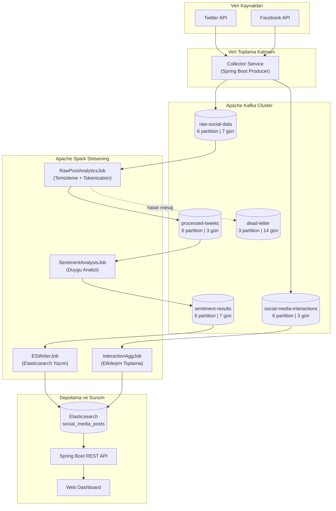

# Apache Kafka Veri Akış Katmanı Mimari Analiz ve Planlama Dokümanı

**Proje:** Dağıtık Sosyal Medya Analiz Platformu  
**Hazırlayan:** Fatih Mehmet Albayrak  
**Tarih:** 14 Mayıs 2026

---

## 1. Amaç

Bu doküman, dağıtık sosyal medya analiz platformunun veri akış katmanı için Apache Kafka mimarisinin analiz ve planlama dokümanıdır. Twitter ve Facebook API'lerinden gelecek ham verilerin sisteme nasıl aktarılacağı incelenerek Kafka topic yapısı tasarlanmış, her topic için partition sayısı, replication factor ve retention policy belirlenmiştir. Apache Spark Streaming'in bu Kafka topic'lerini nasıl tüketeceği planlanmıştır.

---

## 2. Kafka Topic Tasarım Tablosu

| Topic Adı | Veri Türü | Açıklama | Partition | Replication Factor | Retention |
|---|---|---|:---:|:---:|---|
| `raw-social-data` | Ham post/tweet JSON | Twitter ve Facebook API'lerinden toplanan ham veriler | 6 | 3 (local: 1) | 7 gün |
| `processed-tweets` | İşlenmiş metin + tokenlar | Temizlenmiş, tokenize edilmiş ve hashtag çıkarılmış veriler | 6 | 3 (local: 1) | 3 gün |
| `sentiment-results` | Duygu analizi sonuçları | Sentiment skoru ve etiketi atanmış veriler | 6 | 3 (local: 1) | 7 gün |
| `social-media-interactions` | Etkileşim metrikleri | Like, share, comment, view sayıları | 6 | 3 (local: 1) | 3 gün |
| `social-media-dead-letter` | Hatalı mesajlar | İşlenemeyen veya şemaya uymayan mesajlar | 3 | 3 (local: 1) | 14 gün |
| `social-media-topic` | Birleşik test topic'i | Local geliştirme ve mevcut kod uyumluluğu | 3 | 1 | 3 gün |

---

## 3. Partition ve Replication Kararlarının Gerekçeleri

### 3.1. Partition Sayısı Kararları

| Topic | Partition | Gerekçe |
|---|:---:|---|
| `raw-social-data` | 6 | En yüksek hacimli topic; Twitter ve Facebook'tan eşzamanlı veri akışını paralel işlemek için en az consumer sayısı kadar partition gerekir |
| `processed-tweets` | 6 | Ham veriden gelen yüksek hacim devam eder; Spark executor'ları paralel okuma yapabilmeli |
| `sentiment-results` | 6 | Sentiment analizi çıktısı da yüksek hacimli; dashboard sorguları ve ES yazımı paralel yapılmalı |
| `social-media-interactions` | 6 | Etkileşim verileri yüksek frekansta güncellenir (like/share anlık değişir) |
| `social-media-dead-letter` | 3 | Düşük hacimli hata topic'i; fazla partition gereksiz kaynak tüketir |
| `social-media-topic` | 3 | Sadece local test amaçlı; minimum kaynak kullanımı |

### 3.2. Replication Factor Kararları

| Ortam | Replication Factor | Gerekçe |
|---|:---:|---|
| **Production (AWS/Azure)** | 3 | En az 3 broker ile çalışılır; bir broker çökse bile 2 kopya hayatta kalır, veri kaybı sıfır |
| **Local Docker Compose** | 1 | Tek broker ile çalışılır; replication mümkün değil |

### 3.3. Retention Policy Kararları

| Süre | Uygulanan Topic'ler | Gerekçe |
|---|---|---|
| **7 gün** | raw-social-data, sentiment-results | Ham veri ve analiz sonuçları yeniden işlenebilmeli (replay senaryosu) |
| **3 gün** | processed-tweets, interactions, test topic | Ara veri olduğu için uzun saklama gereksiz; ES'e yazıldıktan sonra Kafka'dan okunmaz |
| **14 gün** | dead-letter | Hatalı mesajlar incelenmek üzere uzun süre saklanmalı |

### 3.4. Partition Key Stratejisi

```
Key Format: {platform}_{externalId}
Örnekler  : twitter_TW12345, facebook_FB67890
```

**Gerekçe:** Aynı posta ait tüm event'ler (ham veri → işlenmiş → sentiment) aynı partition'a düşer. Bu sayede:
- Sıralama (ordering) garantisi sağlanır
- Aynı post'un farklı aşamaları doğru sırada işlenir
- Platform bazlı dengeli dağılım elde edilir

---

## 4. Mesaj Şemaları (JSON Format)

### 4.1. Ham Veri — `raw-social-data`

```json
{
  "eventId": "evt-1001",
  "externalId": "TW_123456",
  "platform": "twitter",
  "authorUsername": "kullanici_adi",
  "content": "Bu ürün harika! #teknoloji #yapayZeka",
  "hashtags": ["teknoloji", "yapayZeka"],
  "language": "tr",
  "likes": 42,
  "shares": 8,
  "comments": 5,
  "publishedAt": "2026-05-14T10:30:00Z",
  "collectedAt": "2026-05-14T10:30:05Z"
}
```

### 4.2. İşlenmiş Tweet — `processed-tweets`

```json
{
  "eventId": "proc-2001",
  "externalId": "TW_123456",
  "platform": "twitter",
  "cleanContent": "bu urun harika teknoloji yapayzeka",
  "tokens": ["bu", "urun", "harika", "teknoloji", "yapayzeka"],
  "hashtags": ["teknoloji", "yapayZeka"],
  "language": "tr",
  "processedAt": "2026-05-14T10:30:07Z"
}
```

### 4.3. Duygu Analizi Sonucu — `sentiment-results`

```json
{
  "eventId": "sent-3001",
  "externalId": "TW_123456",
  "platform": "twitter",
  "sentimentLabel": "POSITIVE",
  "sentimentScore": 0.87,
  "confidence": 0.92,
  "analyzedAt": "2026-05-14T10:30:10Z"
}
```

---

## 5. Apache Spark Streaming — Kafka Tüketim Planı

### 5.1. Consumer Group Yapısı

| Consumer Group | Okuduğu Topic | Görev | Çıktı |
|---|---|---|---|
| `raw-post-analytics-group` | `raw-social-data` | Metin temizleme, tokenization, hashtag çıkarımı | `processed-tweets` topic'ine yazar |
| `sentiment-analysis-group` | `processed-tweets` | Ağırlıklı sözlük tabanlı duygu analizi | `sentiment-results` topic'ine yazar |
| `es-writer-group` | `sentiment-results` | Nihai sonucu Elasticsearch'e indeksleme | `social_media_posts` ES indeksi |
| `interaction-agg-group` | `social-media-interactions` | Etkileşim metriklerini zaman penceresiyle toplama | `social_media_posts` ES indeksi |
| `spring-consumer-group` | `social-media-topic` | Spring Boot API üzerinden gelen verileri işleme | `social_media_posts` ES indeksi |

### 5.2. Offset Yönetimi

| Bileşen | Strateji | Açıklama |
|---|---|---|
| **Spark Structured Streaming** | Checkpoint-based | `checkpointLocation` dizininde offset bilgisi saklanır; job restart edildiğinde kaldığı yerden devam eder |
| **Spring Boot Consumer** | `auto-offset-reset: earliest` | İlk başlatmada en eski mesajdan okumaya başlar; sonraki başlatmalarda commit edilmiş offset'ten devam eder |
| **Dead Letter Consumer** | Manual commit | Hatalı mesajlar elle incelendikten sonra commit edilir |

### 5.3. Spark İşleme Adımları

```
1. Kafka'dan stream okunur (readStream → format("kafka"))
2. value alanı JSON olarak parse edilir (from_json)
3. Zorunlu alan kontrolü yapılır (content IS NOT NULL)
4. Hatalı mesajlar dead-letter topic'ine yönlendirilir
5. content alanı temizlenir → lowercase, noktalama kaldır
6. Token'lara bölünür (split)
7. Hashtag'ler regex ile çıkarılır
8. Ağırlıklı sözlük ile sentiment skoru hesaplanır
9. POSITIVE / NEGATIVE / NEUTRAL etiketi atanır
10. İşlenmiş veri Elasticsearch indeksine yazılır (writeStream)
```

---

## 6. Kafka → Spark Veri Akış Mimarisi Diyagramı



---

## 7. Hata Yönetimi ve Dayanıklılık

| Risk | Önlem | Detay |
|---|---|---|
| Kafka broker kesintisi | Replication factor = 3 | Çoklu broker ile veri kaybı önlenir |
| Spark job çökmesi | Checkpoint mekanizması | İş kaldığı yerden devam eder |
| Şemaya uymayan mesaj | Dead Letter Queue | `social-media-dead-letter` topic'ine yönlendirilir |
| Elasticsearch geçici hata | Retry + Bulk yazım | Batch halinde yazım ile geçici hatalara dayanıklılık |
| Consumer lag artışı | Partition artırma | Paralel tüketici sayısını artırarak lag azaltılır |
| Ağ kesintisi | Producer retry | `retries=3`, `retry.backoff.ms=1000` |

---

## 8. Performans Hedefleri

| Metrik | Hedef |
|---|---|
| Kafka Producer Latency | < 100 ms ortalama |
| Kafka Consumer Lag | < 1.000 mesaj (normal yük) |
| Spark Micro-batch Süresi | < 5 saniye |
| Uçtan Uca Gecikme (API → ES) | < 10 saniye |
| Raw Data Throughput | ≥ 1.000 mesaj/saniye |
| ES Bulk Yazım | Batch bazlı, stabil indeksleme |

---

## 9. Sonuç

Kafka veri akış mimarisi, ham sosyal medya içerikleri, etkileşim metrikleri ve duygu analizi sonuçları için ayrı topic'ler ile tasarlanmıştır. Partition ve replication kararları, performans hedefleri ve hata yönetimi stratejileri belirlenmiştir. Bu doküman, ilerleyen haftalardaki gerçek implementasyonun temel referans kaynağı olarak kullanılacaktır.
