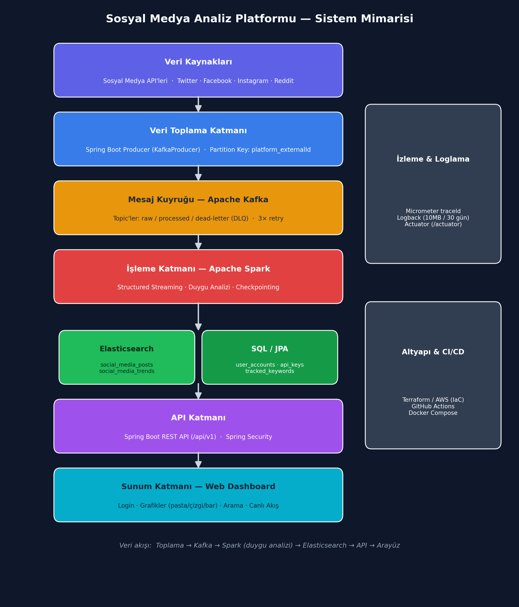
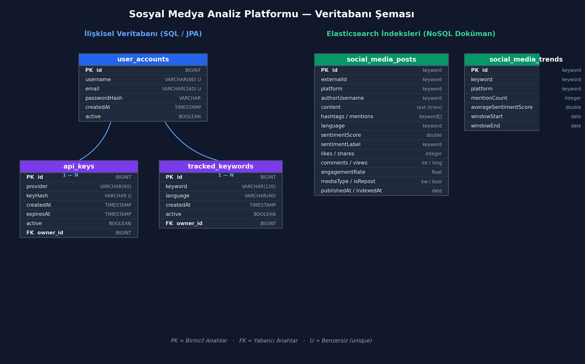

# 📊 BulutKaşifleri — Dağıtık Sosyal Medya Analiz Platformu

> Sosyal medya platformlarından **gerçek zamanlı** veri toplayıp trend konuları belirleyen ve paylaşımların **duygu analizini** yapan, dağıtık mimarili bir analiz platformu.


---

## 🚀 Canlı Demo

Web arayüzü statik olarak yayınlanır (backend olmadan örnek veriyle tam çalışır):

**🔗 https://beray104.github.io/bulutkasifleri/**  ·  Giriş: `admin` / `admin123`

---

## ✨ Özellikler

- 🔐 **Giriş ekranı** ve erişim koruması
- 📊 **Dashboard** — toplam post, pozitif/negatif oran, aktif trend kartları
- 📑 **Ayrı sayfa görünümleri** — Dashboard / Trendler / Duygu Analizi / Son Postlar
- 📈 **Grafikler** — pasta (duygu dağılımı), çizgi (trend akışı), sütun (platform dağılımı); mobil dahil responsive
- 🔍 **Arama** — kullanıcı, anahtar kelime veya platforma göre filtreleme
- 🧪 **Canlı Duygu Testi** — yazılan cümleyi anında pozitif/negatif/nötr olarak sınıflandırır
- ⚡ **Canlı akış simülasyonu** — gerçek zamanlı post akışı; grafikler ve kartlar canlı güncellenir
- 🌙 **Koyu / açık tema** (tercih hatırlanır)
- 🔭 **İzleme & Loglama** — Micrometer `traceId`, Logback (10MB / 30 gün), Actuator
- ☁️ **AWS altyapısı** — Terraform (IaC) ve GitHub Actions CI/CD

---

## 🏗️ Sistem Mimarisi



**Veri akışı:** Toplama → **Kafka** (raw / processed / DLQ) → **Spark** (duygu analizi, checkpointing) → **Elasticsearch** → REST API → Web Dashboard. Kullanıcı/yapılandırma verileri ilişkisel veritabanında (SQL/JPA) tutulur.

---

## 🛠️ Teknoloji Yığını

| Katman | Teknoloji |
| :--- | :--- |
| **Dil / Framework** | Java 21 · Spring Boot 3.5 |
| **Veri Akışı** | Apache Kafka (producer/consumer, DLQ, retry) |
| **Büyük Veri İşleme** | Apache Spark 3.5 (Structured Streaming) |
| **Arama / Depolama** | Elasticsearch 8.15 (turkish/english analyzer) |
| **İlişkisel Veritabanı** | SQL Server (prod) · H2 (yerel/test) · Spring Data JPA |
| **Güvenlik** | Spring Security |
| **İzleme** | Micrometer Tracing · Spring Boot Actuator · Logback |
| **Altyapı** | Terraform (AWS) · Docker Compose · GitHub Actions |
| **Frontend** | HTML · CSS · JavaScript · Chart.js |

---

## 🗄️ Veritabanı Şeması



- **İlişkisel (SQL/JPA):** `user_accounts` 1—N `api_keys`, `tracked_keywords`
- **Elasticsearch indeksleri:** `social_media_posts`, `social_media_trends`

---

## 📁 Proje Yapısı

```
bulutkasifleri/
├── src/main/java/.../social_media_analysis/
│   ├── controller/      # REST API uçları (/api/v1)
│   ├── service/         # İş mantığı
│   ├── kafka/           # Producer / Consumer (DLQ, retry)
│   ├── analytics/       # Spark Structured Streaming işi
│   ├── domain/          # search (Elasticsearch) + sql (JPA) modelleri
│   ├── repository/      # ES ve JPA repository'leri
│   └── config/          # Kafka, Spark, exception handler
├── frontend/            # Statik web dashboard (login, grafikler, arama)
├── infra/terraform/     # AWS altyapısı (IaC)
├── docs/                # Teknik raporlar + diyagramlar
├── scripts/             # Yardımcı scriptler (ES mapping vb.)
└── docker-compose.yml   # ES + Kafka + MSSQL + Zookeeper
```

---

## ▶️ Kurulum ve Çalıştırma

### Seçenek 1 — Sadece arayüz (en hızlı, kurulum yok)
Backend olmadan örnek veriyle tam çalışır:
```bash
python -m http.server 5500 --directory frontend
```
Tarayıcı: **http://localhost:5500/** → `admin` / `admin123`

### Seçenek 2 — Tam yığın (backend + altyapı)
**Gereksinimler:** Java 21, Docker

```bash
# 1) Altyapıyı başlat (Elasticsearch, Kafka, MSSQL, Zookeeper)
docker compose up -d

# 2) Uygulamayı çalıştır
./mvnw spring-boot:run
```
Backend `http://localhost:8080`, API kökü `/api/v1` üzerinden yayın yapar.

### Testler
```bash
./mvnw test
```

---

## 🧠 Duygu Analizi Algoritması

Ağırlıklı sözlük + **kapsamlı (scoped) olumsuzlama** + kural tabanlı bir yaklaşım kullanılır:
- Pozitif/negatif kelimeler ağırlıklandırılır (güçlü +3 … zayıf +1).
- Olumsuzlama tüm cümleyi değil, **yakındaki** kelimeyi ters çevirir (Türkçe "değil" öncekini, İngilizce "not" sonrakini).
- Soru cümleleri ve büyük harf yoğunluğu için ek kurallar uygulanır.

Aynı algoritma hem backend testinde hem de arayüzdeki **Canlı Duygu Testi**'nde kullanılır.

---

## 📚 Dokümantasyon

Ayrıntılı teknik raporlar [`docs/`](docs/) klasöründedir:
- Kafka & Spark Veri Akış Mimarisi ve Topic Tasarımı
- Gerçek Zamanlı Analiz Motoru Mimarisi
- Elasticsearch Veri Modeli ve İndeksleme Prototipi
- Dağıtık Sistem Altyapı Tasarımı (AWS/Azure/GCP)
- Loglama & İzleme, CI/CD Pipeline İyileştirmeleri
- Duygu Analizi Raporu · UAT Raporu ve Geri Bildirim Formu

---

## 👥 Ekip

| Sorumlu | Görev Alanı |
| :--- | :--- |
| **Amine Ceren Yiğit** | Analiz ve Kapsam Yönetimi |
| **Hasan Kara** | Teknoloji Araştırması ve Seçimi |
| **Muhammet Eren Mente** | Teknik Altyapı ve Geliştirme Ortamı |
| **Fatih Mehmet Albayrak** | Versiyon Kontrol ve İş Akış Stratejisi |
| **Beray Akar** | Gereksinim Toplama ve Belgeleme |

---

## 📌 Fonksiyonel Gereksinimler

- **Veri Toplama:** Sistem sosyal medya platformlarından veri toplayabilmelidir.
- **Gerçek Zamanlı Analiz:** Sistem toplanan verileri gerçek zamanlı olarak analiz edebilmelidir.
- **Duygu Analizi:** Sistem sosyal medya paylaşımlarının duygu analizini gerçekleştirebilmelidir.
- **Trend Belirleme:** Sistem trend olan konuları belirleyebilmelidir.
- **Web Arayüzü:** Kullanıcılar analiz sonuçlarını web arayüzü üzerinden görüntüleyebilmelidir.
- **Görselleştirme:** Kullanıcılar verileri grafik veya tablo şeklinde inceleyebilmelidir.

---

## 🎬 Kullanım Senaryosu (Use Case)

**Aktör:** Kullanıcı

**Senaryo akışı:**
1. Kullanıcı sisteme giriş yapar.
2. Kullanıcı sosyal medya analiz panelini açar.
3. Sistem sosyal medya verilerini toplar.
4. Sistem verileri gerçek zamanlı olarak analiz eder.
5. Sistem trend konuları belirler ve duygu analizini yapar.
6. Kullanıcı analiz sonuçlarını grafik veya tablo şeklinde görüntüler.
