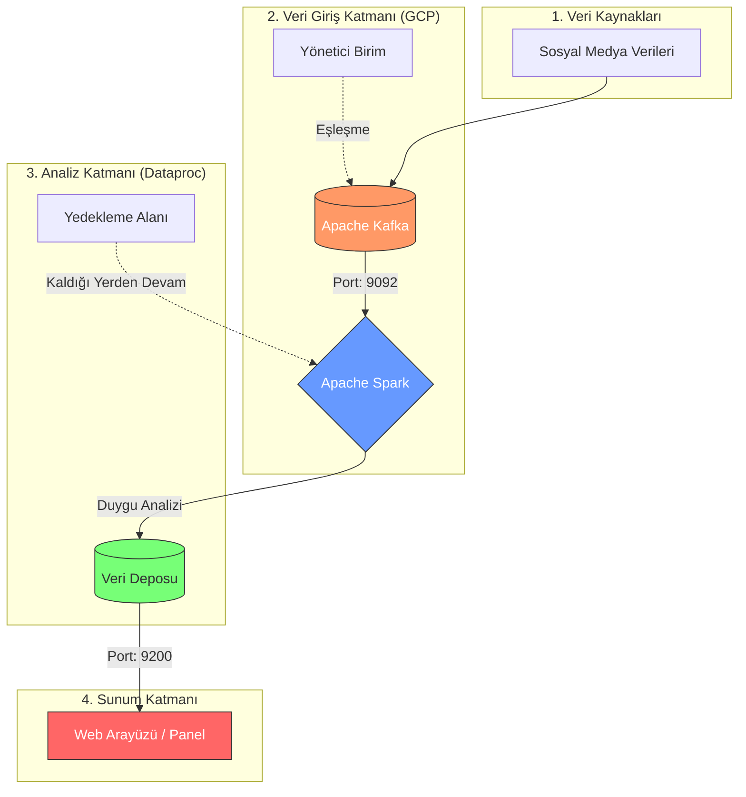

# 🚀 Proje Haftalık İlerleme Takip Çizelgesi

### 📅 [Hafta No] | [Tarih Aralığı]

| Ekip Üyesi | Sorumluluk Alanı | Bu Hafta Ne Yaptı? | Durum |
| :--- | :--- | :--- | :---: |
| **Amine Ceren Yiğit** | Analiz ve Kapsam | [Buraya kısa not yazın] | 🟢  |
| **Hasan Kara** | Teknoloji Araştırması | [Buraya kısa not yazın] | 🟢 |
| **Muhammet Eren Mente** | Teknik Altyapı | [Buraya kısa not yazın] | 🟢 |
| **Fatih Mehmet Albayrak** | Versiyon Kontrol | [Buraya kısa not yazın] | 🟢  |
| **Beray Akar** | Gereksinim & Belgeleme | [Buraya kısa not yazın] |🟢 |
---

### 📝 Haftalık Detaylı Notlar (Özet)

* **Amine Ceren:** Bulut Kaşifleri projesinin kapsamını ve hedeflerini detaylı bir şekilde analiz edip projenin temel işlevlerini ve kullanıcı hikayelerini belirledi.
* **Hasan:** Proje için en uygun bulut teknolojilerini (AWS, Azure, GCP vb.) araştırıp her bir teknolojinin avantajlarını, dezavantajlarını ve maliyetlerini karşılaştıran rapor hazırlandı.
* **Muhammet Eren:** Geliştirme ortamı (IDE ve eklentiler) standart hale getirildi, yetkiler verildi.
* **Fatih Mehmet:** Git kullanarak bir versiyon kontrol sistemi kurun ve yapılandırıp proje kodunun etkili bir şekilde yönetilmesi için dallanma stratejileri oluşturdu.
* **Beray:** Proje için gerekli olan bilgiler dokümante edip paylaşıldı.

---

### 🚩 Durum Anahtarı
* 🟢 **Tamamlandı**
* 🟡 **Devam Ediyor**
* ⚪ **Henüz Başlamadı**
* 🔴 **Engel Var / Sorunlu**

---

### 💡 Ekip Notları & Kararlar
* *Örnek: Haftalık toplantılar her Salı saat 20:00'de Discord üzerinden yapılacaktır.*
* *Örnek: Kod paylaşımlarında GitFlow stratejisine uyulacaktır.*

Bulut Kaşifleri Projesi – Kapsam ve Hedef Analizi || Amine Ceren Yiğit 

**1. Proje Tanımı**

Bulut Kaşifleri projesi, sosyal medya platformlarından elde edilen verileri toplayarak bu verileri gerçek zamanlı olarak analiz eden ve kullanıcıya anlamlı bilgiler sunan dağıtık bir veri analiz platformudur. Sistem, büyük hacimli sosyal medya verilerini işleyerek güncel trendleri, kullanıcı duygu durumlarını ve içerik eğilimlerini belirlemeyi amaçlamaktadır.
Bu proje, büyük veri teknolojileri ve bulut tabanlı mimariler kullanılarak ölçeklenebilir bir analiz altyapısı oluşturmayı hedeflemektedir.

**2. Projenin Amacı**

Bulut Kaşifleri projesinin temel amacı, sosyal medya platformlarında oluşan büyük veri akışını analiz ederek anlamlı içgörüler üretmektir.
Projenin başlıca amaçları şunlardır:
*	Sosyal medya verilerini gerçek zamanlı olarak toplamak
*	Büyük veri akışını dağıtık sistemler üzerinde işlemek
*	Trend olan konuları ve hashtagleri tespit etmek
*	Paylaşımların duygu analizini gerçekleştirmek
*	Analiz sonuçlarını kullanıcı dostu bir web arayüzü üzerinden sunmak
*	Büyük veri teknolojilerinin uygulanabileceği bir analiz altyapısı oluşturmak
Bu amaçlar doğrultusunda sistem, veri analizi ve karar destek süreçlerine katkı sağlayabilecek bir platform sunacaktır.

**3. Projenin Kapsamı**

Projenin kapsamı, sosyal medya verilerinin toplanması, işlenmesi, analiz edilmesi ve sonuçların kullanıcıya sunulması süreçlerini içermektedir.

Proje kapsamında gerçekleştirilecek temel faaliyetler şunlardır:
*	Sosyal medya API'leri aracılığıyla veri toplama
* Toplanan verilerin ön işleme sürecinden geçirilmesi
*	Gerçek zamanlı veri akışı yönetimi
*	Metin tabanlı duygu analizi yapılması
*	Trend konuların ve hashtaglerin belirlenmesi
*	Analiz sonuçlarının görselleştirilmesi
*	Sistem bileşenlerinin bulut ortamında çalışabilecek şekilde tasarlanması
Proje kapsamında geliştirilecek sistem, analiz sonuçlarını kullanıcıların inceleyebileceği bir web tabanlı arayüz üzerinden sunacaktır.

Kapsam Dışı Unsurlar

Aşağıdaki özellikler proje kapsamı dışında tutulmaktadır:
*	Sosyal medya platformu geliştirilmesi
*	Kullanıcıların içerik paylaşabileceği bir sosyal ağ oluşturulması
*	Gelişmiş derin öğrenme tabanlı dil modellerinin geliştirilmesi
*	Tüm sosyal medya platformlarının entegrasyonu
Bu sınırlamalar, projenin uygulanabilir ve yönetilebilir bir ölçekte kalmasını sağlamak amacıyla belirlenmiştir.

**4. Projenin Hedefleri**

Projenin hedefleri teknik ve işlevsel hedefler olarak iki ana gruba ayrılabilir.
Teknik Hedefler
*	Dağıtık sistem mimarisi kullanarak veri işleme altyapısı oluşturmak
*	Büyük veri akışını işleyebilen ölçeklenebilir bir sistem geliştirmek
*	Gerçek zamanlı veri analiz mekanizması oluşturmak
*	Bulut tabanlı teknolojilerle çalışabilecek bir yapı kurmak
İşlevsel Hedefler
*	Kullanıcıların sosyal medya trendlerini görüntüleyebilmesini sağlamak
*	Belirli anahtar kelimeler için duygu analizi sonuçlarını sunmak
*	En çok kullanılan hashtagleri ve kelimeleri tespit etmek
*	Zaman bazlı veri analizini görselleştirmek

**5. Projenin Temel İşlevleri**

Bulut Kaşifleri sistemi aşağıdaki temel işlevlere sahip olacaktır.
1. Veri Toplama
Sistem, sosyal medya platformlarının API servislerini kullanarak belirli anahtar kelimeler, hashtagler veya konular üzerinden veri toplayacaktır.
2. Veri Ön İşleme
Toplanan veriler analiz sürecinden önce temizlenecek ve düzenlenecektir. Bu aşamada:
*	gereksiz karakterler kaldırılacak
*	metin verileri filtrelenecek
*	analiz için uygun format oluşturulacaktır
3. Gerçek Zamanlı Veri Analizi
Sistem, veri akışını analiz ederek:
*	en çok kullanılan kelimeleri
*	trend hashtagleri
*	popüler konuları
tespit edecektir.
4. Duygu Analizi
Paylaşımlar metin analizi yöntemleri kullanılarak sınıflandırılacaktır.
İçerikler:
*	pozitif
*	negatif
*	nötr
olarak kategorize edilecektir.
5. Veri Depolama
Analiz edilen veriler, hızlı erişim ve sorgulama amacıyla uygun veri depolama sistemlerinde saklanacaktır.
6. Veri Görselleştirme
Sistem, analiz sonuçlarını grafikler, tablolar ve istatistiksel görseller aracılığıyla kullanıcıya sunacaktır.

**6. Kullanıcı Rolleri**

Sistemde iki temel kullanıcı rolü bulunmaktadır.
Veri Analisti
Sosyal medya verilerini inceleyen ve analiz sonuçlarını değerlendiren kullanıcıdır.
Sistem Yöneticisi
Sistemin teknik işleyişini ve veri akışını kontrol eden kullanıcıdır.

**7. Kullanıcı Hikayeleri (User Stories)**

Kullanıcı hikayeleri, sistemin kullanıcı ihtiyaçlarına göre nasıl çalışacağını tanımlamaktadır.
Veri Analisti
*	Bir veri analisti olarak sosyal medya trendlerini görmek istiyorum, böylece güncel konuları analiz edebilirim.
*	Bir veri analisti olarak belirli bir anahtar kelime hakkında yapılan paylaşımların duygu analizini görmek istiyorum, böylece kullanıcı görüşlerini değerlendirebilirim.
*	Bir veri analisti olarak belirli bir zaman aralığında en çok kullanılan hashtagleri görmek istiyorum, böylece trend değişimlerini inceleyebilirim.

Sistem Yöneticisi
*	Bir sistem yöneticisi olarak veri akışının sorunsuz çalışmasını izlemek istiyorum, böylece sistem performansını kontrol edebilirim.
*	Bir sistem yöneticisi olarak sistemin veri işleme kapasitesini izlemek istiyorum, böylece gerektiğinde ölçeklendirme yapabilirim.

**8. Sonuç**

Bulut Kaşifleri projesi, sosyal medya verilerinin gerçek zamanlı olarak analiz edilmesini sağlayan dağıtık bir veri analiz platformu geliştirmeyi amaçlamaktadır. Proje, büyük veri teknolojilerinin kullanıldığı ölçeklenebilir bir sistem mimarisi üzerine kurulacaktır.
Bu sistem sayesinde kullanıcılar sosyal medya trendlerini, kullanıcı duygu analizlerini ve içerik eğilimlerini analiz edebilecek ve bu verilerden anlamlı çıkarımlar elde edebilecektir.

# ☁️ BULUT TEKNOLOJİLERİ ARAŞTIRMA VE KARŞILAŞTIRMA RAPORU

**Hazırlayan:** Hasan Kara  
**Proje Adı:** Dağıtık Sosyal Medya Analiz Platformu  
**Görev:** Bulut Teknolojileri Araştırması  
**Teslim Tarihi:** 7 Mart 2026

---

## 1. GİRİŞ VE TEKNİK TERİMLER
Bu rapor, projemizdeki karmaşık veri işleme süreçlerini destekleyecek bulut altyapısını analiz eder. Projemiz şu teknolojiler üzerine kuruludur:

* **Apache Kafka:** Veri akışını kesintisiz yönetmek için kullanılır.
* **Apache Spark:** Dağıtık mimaride gerçek zamanlı veri analizi ve duygu analizi yapar.
* **Elasticsearch:** Verilerin hızlıca filtrelenmesini ve sorgulanmasını sağlar.

---

## 2. PLATFORMLARIN KARŞILAŞTIRMALI ANALİZİ

### 2.1. Amazon Web Services (AWS)
* **Avantajlar (+):** Sektörün en köklü platformudur; Kafka yönetimi için Amazon MSK ve Spark işlemleri için Amazon EMR gibi çok olgun servisler sunar.
* **Dezavantajlar (-):** Servis sayısı çok fazla olduğu için yapılandırması karmaşıktır; yanlış bir ayar bütçeyi hızla tüketebilir.
* **Maliyet:** Kullandıkça öde modeli esnektir ancak veri transferi (Data Out) ücretleri 3 aylık bir projede sürpriz maliyetler çıkarabilir.

### 2.2. Google Cloud Platform (GCP)
* **Avantajlar (+):** Büyük veri işlemede kullanılan Dataproc servisi, Spark kümelerini saniyeler içinde ayağa kaldırır. Duygu analizi için Google'ın hazır NLP API'leri en ileri seviyededir.
* **Dezavantajlar (-):** Kurumsal uygulama entegrasyonu tarafında AWS kadar geniş bir kütüphane sunmayabilir.
* **Maliyet:** Yeni kullanıcılara verilen 300$ kredi, tam olarak projemizin 3 aylık süresini kapsayacak şekilde planlanmıştır.

### 2.3. Microsoft Azure
* **Avantajlar (+):** Java/Spring Boot ekosistemiyle uyumludur; öğrenci mailiyle kredi kartsız 100$ kredi verir.
* **Dezavantajlar (-):** Yönetim paneli ve konfigürasyon süreçleri rakiplerine göre daha yavaş kalabilmektedir.
* **Maliyet:** Orta düzey projeler için uygundur ancak yoğun veri akışında 100$ kredi yetersiz kalabilir.

### 2.4. Alternatif Çözümler (DigitalOcean & Oracle)
* **DigitalOcean:** Sabit fiyatlıdır (aylık 5-10$); Kafka'yı "Managed" servis olarak sunarak kurulum yükünü azaltır.
* **Oracle Cloud (OCI):** "Always Free" katmanı ile 4 adet güçlü ARM sunucuyu ömür boyu ücretsiz vererek maliyeti sıfıra indirir.

---

## 3. TEKNİK KARŞILAŞTIRMA TABLOSU

| Özellik | AWS | GCP | Azure | DigitalOcean |
| :--- | :--- | :--- | :--- | :--- |
| **Kafka/Spark Gücü** | Çok Yüksek | Çok Yüksek | Yüksek | Orta |
| **Öğrenci Desteği** | Kısıtlı Free Tier | 300$ Kredi | 100$ Kredi | 200$ Kredi (Geçici) |
| **3 Ay Süre Uyumu** | Orta | **Tam Uyum** | Orta | **Tam Uyum** |
| **Maliyet Tahmini** | Değişken | Ücretsiz (Kredi) | Ücretsiz (Kredi) | Sabit |

---

## 4. SONUÇ VE ÖNERİ
Proje süresi (3 ay) ve saniyedeki veri işleme ihtiyacı göz önüne alındığında;

1. **Birinci Tercih (GCP):** Proje takvimiyle örtüşen 300 dolarlık kredisi ve Dataproc servisinin hızı nedeniyle önerilir.
2. **Sektörel Tercih (AWS):** Profesyonel portfolyo değeri ve geniş dökümantasyon desteği için tercih edilmelidir.

**Karar:** Geliştirme sürecinde bütçe güvenliği ve analiz performansı sağlamak adına projenin **Google Cloud Platform (GCP)** üzerinde yürütülmesi uygun görülmüştür.

**Veritabanı Şeması, İlişkiler ve Veri Tutma Stratejisi  || Amine Ceren Yiğit** 

**1. Veri Katmanları ve Veri Akış Mimarisi*

Bulut Kaşifleri projesinde veri yönetimi, farklı sosyal medya platformlarından gelen verilerin tek bir sistemde toplanması, işlenmesi ve 

analiz edilmesi amacıyla çok katmanlı bir mimari ile tasarlanmıştır. Bu yapı, farklı veri kaynaklarının entegrasyonunu desteklerken aynı 

zamanda sistemin ölçeklenebilir ve sürdürülebilir olmasını sağlar.

1.1 Veri Kaynak Katmanı (Data Source Layer)

Bu katman, verinin elde edildiği tüm sosyal medya platformlarını kapsamaktadır.

Veri kaynakları:

•	Twitter (X API)

•	Instagram

•	Pinterest

•	Reddit API

•	YouTube Data API

Veri türleri:

•	Metin içerikleri (post, tweet, açıklamalar)

•	Hashtagler

•	Görsel açıklamaları (caption)

•	Kullanıcı bilgileri

•	Zaman bilgisi (timestamp)

Veri alma yöntemleri:

1.	Resmi API kullanımı

Platformların sağladığı API'ler üzerinden veri çekilir.

Not: Instagram ve Pinterest API erişimleri kısıtlı olabilir.

2.	Anahtar kelime ve hashtag bazlı sorgular

Belirli konular üzerinden veri filtrelenir.

3.	Periyodik veri çekme (Polling)

Belirli zaman aralıklarında veri alınır.

4.	Gerçek zamanlı veri akışı (Streaming)

Destekleyen platformlarda anlık veri akışı sağlanır.

Bu katmanda veri ham ve işlenmemiş durumdadır.

1.2 Veri Toplama Katmanı (Ingestion Layer)

Bu katman, farklı platformlardan gelen verileri standart bir formata dönüştürerek sisteme dahil eder.

Kullanılan yapı:

•	Spring Boot tabanlı veri toplama servisleri

•	Her platform için ayrı veri çekme modülü

İşlevler:

•	API veya veri kaynağından veri çekme

•	Farklı veri formatlarını normalize etme (ortak JSON yapısına dönüştürme)

•	Eksik ve hatalı verileri filtreleme

•	Veriyi mesaj kuyruğuna gönderme

Veri standardizasyonu örneği:

{

  "platform": "instagram",
  
  "content": "...",
  
  "hashtags": ["tag1", "tag2"],
  
  "timestamp": "...",
  
  "user": "..."

}

Veri akışı:

Sosyal Medya → Veri Toplama Servisleri → Mesaj Kuyruğu

Bu katman, farklı platformlardan gelen veriyi tek tip hale getirir.

1.3 Veri Akış Katmanı (Streaming Layer)

Bu katman, verinin sistem içinde gerçek zamanlı olarak taşınmasını sağlar.

Kullanılan teknoloji:

•	Apache Kafka

İşlevler:

•	Veriyi topic’ler halinde ayırma (örneğin: twitter-posts, instagram-posts)

•	Yüksek hacimli veri akışını yönetme

•	Producer ve consumer yapısını yönetme

•	Veri kaybını önleme

Veri akışı:

Producer → Kafka Topic → Consumer

Avantajları:

•	Platform bağımsız veri akışı

•	Yüksek performans

•	Dağıtık sistem desteği

1.4 Veri İşleme Katmanı (Processing Layer)

Bu katman, verinin analiz edildiği bölümdür.

Kullanılan teknoloji:

•	Apache Spark (Streaming)

İşlevler:

•	Veri temizleme (noise removal)

•	Metin normalizasyonu

•	Hashtag çıkarımı

•	Kelime frekans analizi

•	Duygu analizi

•	Platformlar arası karşılaştırmalı analiz

Örnek analizler:

•	Instagram ve Twitter’da ortak trendler

•	En çok kullanılan hashtagler

•	Platform bazlı duygu dağılımı

Bu katman sistemin analiz motorudur.

1.5 Veri Saklama Katmanı (Storage Layer)

Bu katman, verinin saklandığı ve sorgulandığı bölümdür.

1.5.1 Operasyonel Veritabanı

•	Ham veriler tutulur

•	Kısa süreli saklama yapılır

•	İlişkisel veritabanı kullanılır (PostgreSQL / MySQL)

Tutulan veriler:

•	posts

•	users

•	hashtags

Not: platform alanı sayesinde veriler ayrıştırılır.

1.5.2 Analitik Veritabanı

•	İşlenmiş veriler tutulur

•	Uzun süre saklanır

•	Hızlı arama ve analiz yapılır

Kullanılan teknoloji:

•	Elasticsearch

Tutulan veriler:

•	trend analizleri

•	duygu analizi sonuçları

•	platform bazlı istatistikler

1.6 Sunum Katmanı (Presentation Layer)

Bu katman, analiz sonuçlarının kullanıcıya sunulduğu arayüzdür.

İşlevler:

•	Dashboard görüntüleme

•	Grafikler ve veri görselleştirme

•	Platform bazlı filtreleme (Instagram, Twitter vb.)

•	Zaman bazlı analiz

Gösterilen veriler:

•	Trend hashtagler

•	Duygu analizi sonuçları

•	Platform karşılaştırmaları

2. Tablolar ve Açıklamaları

2.1 USERS

Kullanıcı bilgilerini tutar.

users

------

id (PK)

kullanıcı adı

platform

takipçi

email

oluşturulma zamanı

2.2 POSTS

Sosyal medya içeriklerini tutar.

posts

------

id (PK)

platform

içerik

oluşturulma zamanı

dil

kullanıcı id  (FK)

2.3 HASHTAGS

Hashtag bilgilerini tutar.

hashtags

------

id (PK)

tag ismi

2.4 POST_HASHTAG

Post ile hashtag arasındaki çoktan çoğa ilişkiyi sağlar.

post_hashtag

------

post_id (FK)

hashtag_id (FK)

2.5 SENTIMENT_ANALYSIS

Her post için yapılan duygu analizi sonuçlarını tutar.

Duygu analizi

------

id (PK)

post_id (FK)

ifadeler (pozitif, negatif, nötr)

skor

analiz zamanı

2.6 TRENDS

Trend hashtag ve analiz sonuçlarını tutar.

trends

------
id (PK)

hashtag_id (FK)

sayaç

time_window

oluşturulma zamanı

3. Tablolar Arası İlişkiler

•	users ile posts arasında bire çok ilişki vardır.

Bir kullanıcı birden fazla post paylaşabilir.

•	posts ile sentiment_analysis arasında bire bir ilişki vardır.

Her post için bir analiz sonucu bulunur.

•	posts ile hashtags arasında çoktan çoğa ilişki vardır.

Bir post birden fazla hashtag içerebilir, bir hashtag birden fazla postta bulunabilir.

•	hashtags ile trends arasında bire çok ilişki vardır.

Bir hashtag farklı zaman dilimlerinde farklı trend kayıtlarına sahip olabilir.

4. Veri Tutma Stratejisi

4.1 Ham Veri Yönetimi

•	Ham sosyal medya verileri yüksek hacimlidir.

•	Bu veriler kısa süreli saklanır (örneğin 7–30 gün).

•	Eski veriler sistemden silinir veya arşivlenir.

Amaç: Depolama maliyetini azaltmak ve sistemi hızlı tutmak.

4.2 Analiz Verisi Yönetimi

•	Duygu analizi ve trend verileri uzun süre saklanır.

•	Dashboard ve kullanıcı sorguları bu veriler üzerinden çalışır.

•	Analiz verileri optimize edilmiş şekilde tutulur.

4.3 Zaman Bazlı Bölümlendirme (Partitioning)

Veriler zaman bazlı olarak bölümlere ayrılır.

Örnek:

•	Günlük veya haftalık partition kullanımı

•	Sorgular sadece ilgili zaman aralığında çalışır

Bu yöntem performansı artırır.

5. Kullanılacak Veritabanı Teknolojileri

•	İlişkisel veritabanı: PostgreSQL veya MySQL

Yapısal veriler ve ilişkiler için kullanılır.

•	Analitik ve arama motoru: Elasticsearch

Hızlı arama, filtreleme ve dashboard işlemleri için kullanılır.

6. Genel Değerlendirme

Bu veritabanı tasarımı:

•	Ölçeklenebilir bir yapı sunar

•	Büyük veri akışını yönetebilir

•	Gerçek zamanlı analiz sistemine uygundur

•	Veri tekrarını önler ve ilişkisel bütünlüğü korur

Tasarım, proje kapsamına uygun olarak sade tutulmuş ve genişletilebilir şekilde planlanmıştır.

7. Genel Veri Akışı

Sistem genelinde veri akışı aşağıdaki gibidir:

Sosyal Medya Platformları

(Twitter, Instagram, Pinterest, vb.)
        ↓
Veri Toplama Katmanı
        ↓
Kafka (Streaming)
        ↓
Spark (Processing)
        ↓
Veritabanları (Storage)
        ↓
Web Arayüz (Presentation)

8. Veri Yönetimi Kararlarının Gerekçesi

•	Farklı sosyal medya platformları tek sistemde birleştirilmiştir

•	Veri standardizasyonu sayesinde analiz süreci kolaylaştırılmıştır

•	Streaming mimarisi ile gerçek zamanlı veri işlenmesi sağlanmıştır

•	Ham veri ve analiz verisi ayrılarak performans artırılmıştır

•	Dağıtık yapı ile sistem ölçeklenebilir hale getirilmiştir

Bu mimari, çoklu veri kaynağına sahip büyük veri sistemlerinin yönetimi için uygun, genişletilebilir ve performans odaklı bir çözüm 
sunmaktadır.

# 🏗️ DAĞITIK SOSYAL MEDYA ANALİZ PLATFORMU: MİMARİ TASARIM DOKÜMANI

**Hazırlayan:** Hasan Kara  
**Görev:** Sistem Bileşenleri Entegrasyonu ve Teknik Mimari  
**Teslim Tarihi:** 28 Mart 2026  

---

## 1. GİRİŞ VE HEDEFLER
Bu doküman, projemizin saniyede binlerce veriyi işleyebilecek dağıtık mimarisini ve Google Cloud Platform (GCP) üzerindeki entegrasyon süreçlerini detaylandırır. Temel hedef; düşük gecikmeli, hata toleranslı ve ölçeklenebilir bir analiz hattı kurmaktır.

---

## 2. SİSTEM KOMPONENTLERİNİN ENTEGRASYONU VE ÇALIŞMA SÜRECİ

Sistemimizdeki teknolojiler birbirine şu teknik protokoller ve yöntemlerle entegre edilmiştir:

### 2.1. Veri Toplama ve Kafka Entegrasyonu (Ingestion)
* **Entegrasyon:** Sosyal medya API'lerinden gelen ham veriler, bir **Python Producer** script'i aracılığıyla çekilir.
* **Bağlantı:** Veriler, Kafka'nın varsayılan **9092 portu** üzerinden sisteme basılır.
* **Çalışma Mantığı:** Gelen her veri, bir "Topic" içine JSON objesi olarak asenkron şekilde yazılır. Bu sayede veri hızı artsa bile sistem tıkanmaz.

### 2.2. Spark ve Dataproc Entegrasyonu (Processing)
* **Entegrasyon:** GCP Dataproc üzerinde kurulu olan Spark, Kafka topic'lerine "Subscriber" (abone) olarak bağlanır.
* **Bağlantı:** Veri okuma işlemi kesintisiz takip edilir (offset yönetimi ile).
* **Çalışma Mantığı:** Spark, gelen verileri **Memory (Bellek)** üzerinde işler. NLP kütüphaneleri her satırı analiz eder ve sonuçları geçici bir veri tablosuna dönüştürür.

### 2.3. Elasticsearch ve Cloud Run Entegrasyonu (Output)
* **Entegrasyon:** Analiz edilen veriler, Spark'ın **Elasticsearch-Hadoop** kütüphanesi kullanılarak Elasticsearch indekslerine "REST API" üzerinden gönderilir.
* **Bağlantı:** Elasticsearch'ün **9200 portu** üzerinden JSON formatında indeksleme yapılır.
* **Sistem Çalışması:** Cloud Run üzerinde koşan Frontend (React/Vue), Elasticsearch'e sorgular atarak analiz edilen verileri saniyeler içinde görselleştirir.

---

## 3. HATA TOLERANSI VE SİSTEM GÜVENLİĞİ
* **Entegre Güvenlik:** Tüm bileşenler **GCP VPC** içinde izole edilmiştir.
* **Resiliency:** Spark'ın `checkpointLocation` özelliği sayesinde sistem çökerse veri kaybı yaşanmadan devam eder.

---

## 📐 4. GENEL SİSTEM MİMARİSİ (ŞEMA)

---

# 🧪 UI ENTEGRASYON TESTLERİ VE HATA DÜZELTMELERİ

**Hazırlayan:** Beray Akar
**Görev:** Geliştirilen kullanıcı arayüzü bileşenlerinin entegrasyon testlerinin tamamlanması, hataların düzeltilmesi ve test sonuçlarının dokümante edilmesi
**Teslim Tarihi:** 26 Nisan 2026

---

## 1. Yapılan İş Özeti

Hafta 5 kapsamında web arayüzünü oluşturan tüm bileşenler (`index.html`, `api.js`, `style.css`) entegrasyon açısından incelenmiş, 10 test senaryosu üzerinden doğrulanmış ve tespit edilen 9 hata düzeltilmiştir. Sonuçlar ayrı bir test raporu dosyasında detaylı olarak belgelenmiştir.

## 2. Test Edilen Bileşenler

- Arama input alanı ve test butonu
- Pasta grafik (Duygu Analizi Dağılımı)
- Çizgi grafik (Trend Akışı)
- Alert ve durum mesajı sistemi
- API hata yönetimi ve simülasyon (mock) akışı

## 3. Tespit Edilen ve Düzeltilen Hatalar

| # | Hata | Çözüm |
|---|------|-------|
| 1 | Mobil viewport meta etiketi yoktu | `<meta name="viewport">` eklendi |
| 2 | Enter tuşu ile arama yapılamıyordu | `keydown` listener eklendi |
| 3 | Input için label/aria-label yoktu | Erişilebilirlik etiketleri eklendi |
| 4 | Çift tıklama koruması yoktu | Buton `disabled` + loading state |
| 5 | Alert mesajları gayri resmi tondaydı | Profesyonel dil + durum paneli |
| 6 | Grafik canvas yüksekliği kontrolsüzdü | `max-height` + `maintainAspectRatio` |
| 7 | Mobilde grid bozuluyordu | `@media (max-width: 768px)` kuralı |
| 8 | Sürekli alert kullanımı UX'i bozuyordu | Hata bildirimleri durum paneline taşındı |
| 9 | Input değerinde `trim()` yapılmıyordu | Boşluk kontrolü eklendi |

## 4. Test Sonucu

| Metrik | Değer |
|---|---|
| Toplam Senaryo | 10 |
| Başarılı (PASSED) | 10 |
| Başarısız (FAILED) | 0 |
| Düzeltilen Hata | 9 |

## 5. Versiyon Kontrol

Yapılan değişiklikler `dev/berayakar-hafta5-ui-test` branch'ine commit edilmiş ve uzak repoya (GitHub) push edilmiştir. `main` branch'ine merge işlemi pull request üzerinden gerçekleştirilecektir.

- **Commit:** `Hafta 5: UI entegrasyon testleri tamamlandı ve hatalar düzeltildi`
- **Branch:** `dev/berayakar-hafta5-ui-test`
- **Eklenen Dosya:** `UI_Entegrasyon_Test_Raporu.md`

## 6. Sonuç

Web arayüzünün tüm bileşenleri birbiriyle ve dış kütüphaneler (Chart.js) ile uyumlu çalışmaktadır. Tespit edilen tüm hatalar giderilmiş, kullanılabilirlik (UX) ve erişilebilirlik (a11y) seviyeleri yükseltilmiştir. Uygulama masaüstü ve mobil cihazlarda tutarlı şekilde çalışır hale gelmiştir.

# 🚀 API ENTEGRASYONU VE TEST RAPORU

**Proje:** Dağıtık Sosyal Medya Analiz Platformu  
**Hafta:** Hafta 2 
**Tarih:** 26 Nisan 2026  
**Hazırlayan:** Hasan Kara

---

## 📋 Görev Bilgileri

| Başlık | Detay |
| :--- | :--- |
| **Görev** | API Entegrasyonu ve Test Senaryoları Doğrulaması |
| **Hazırlayan** | Hasan Kara |
| **Tarih** | 26 Nisan 2026 |
| **Referans Tasarım** | Fatih Mehmet Albayrak (API Mimarisi ve JSON Şeması) |

---

## 1. Giriş ve Amaç

[cite_start]Bu rapor, Fatih Mehmet Albayrak tarafından tasarlanan RESTful API mimarisinin ve JSON veri şemasının, platformun Ön Yüzüne (Frontend) başarıyla entegre edildiğini kanıtlamak amacıyla hazırlanmıştır[cite: 41]. [cite_start]Gerçek Backend sunucusunun aktif olmadığı durumlar göz önüne alınarak **Mock (Simülasyon) API** yaklaşımı kullanılmış ve sistemin veri çekme ile hata yönetimi süreçleri test edilmiştir[cite: 42].

---

## 2. Test Senaryoları ve Kanıtlar

### 🧪 Senaryo 1: Hata Yönetimi (Error Handling) Testi
* [cite_start]**Amaç:** Sistem Backend sunucusuna ulaşamadığında uygulamanın çökmeden kullanıcıya kontrollü bir şekilde uyarı verip veremediğinin doğrulanması[cite: 45].
* [cite_start]**Sonuç:** **BAŞARILI (PASSED)**[cite: 46].
* [cite_start]**Gözlem:** Sistem ilgili hatayı yakalamış ve arayüze şu uyarıyı başarıyla yansıtmıştır[cite: 46]:
  > [cite_start]*"SİSTEM UYARISI: Gerçek API sunucusuna şu an ulaşılamıyor. Simülasyon Moduna Geçiliyor..."* [cite: 48, 49]

### 🧪 Senaryo 2: JSON Veri Okuma ve İşleme Testi
* [cite_start]**Amaç:** Tasarlanan JSON formatındaki verinin (Mektup Formatı) arayüz tarafından doğru bir şekilde parçalanıp (parse edilip) kullanıcıya sunulmasının test edilmesi[cite: 52].
* [cite_start]**Sonuç:** **BAŞARILI (PASSED)**[cite: 53].
* [cite_start]**Gözlem:** Sistem, mock veriyi başarılı bir şekilde okumuş; kullanıcı adını (@analizci), duygu durumunu (Positive) ve güven skorunu (%94) ekrana eksiksiz yansıtmıştır[cite: 53, 54, 57, 58, 59].

---

## 3. Sonuç Değerlendirmesi

[cite_start]**DOĞRULANDI:** Web arayüzünün (Frontend), planlanan API uç noktalarına doğru veri yapısıyla istek atabildiği, hatalı durumlarda çökmediği (Error Handling) ve beklenen JSON veri formatını arayüzde kusursuz bir şekilde görselleştirebildiği kanıtlanmıştır[cite: 62, 63]. 

[cite_start]**API Entegrasyonu görevi başarıyla tamamlanmıştır.** [cite: 64]

---
**Hazırlayan:** Hasan Kara | **Tarih:** 26 Nisan 2026 | **Hafta 5 Teslimi**

# 📊 UI PERFORMANS TEST RAPORU

[cite_start]**Proje:** Sosyal Medya Analiz Platformu [cite: 35]  
[cite_start]**Hafta:** Hafta 4 [cite: 36, 38]  
[cite_start]**Tarih:** 25 Nisan 2026 [cite: 36, 38]  
[cite_start]**Hazırlayan:** Hasan Kara [cite: 36, 38, 68]

---

## [cite_start]1. Genel Bilgiler [cite: 37]

| Başlık | Detay |
| :--- | :--- |
| **Proje Adı** | [cite_start]Sosyal Medya Analiz Platformu [cite: 38] |
| **Test Eden** | [cite_start]Hasan Kara [cite: 38] |
| **Test Tarihi** | [cite_start]25 Nisan 2026 [cite: 38] |
| **Hafta** | [cite_start]Hafta 4 [cite: 38] |
| **Test Ortamı** | [cite_start]Chrome 147 + Lighthouse + Live Server (localhost:5500) [cite: 38] |
| **Referans Tasarım** | [cite_start]Muhammet Eren Mente - UI/UX Wireframe (Hafta 3) [cite: 38] |

---

## [cite_start]2. Test Edilen Bileşenler [cite: 39]

[cite_start]Hafta 3'te Muhammet Eren Mente tarafından hazırlanan wireframe tasarımı esas alınarak aşağıdaki bileşenler geliştirilmiş ve test edilmiştir: [cite: 40]

* [cite_start]**Arama Kutusu:** Real-time anahtar kelime girişi. [cite: 41]
* [cite_start]**Pie Chart:** Duygu Analizi Dağılımı (Pozitif / Negatif / Nötr). [cite: 42]
* [cite_start]**Line Chart:** Aktif Veri Akışı (Trend Takibi). [cite: 42]

---

## [cite_start]3. Lighthouse Performans Test Sonuçları [cite: 43]

| Kategori | Skor | Durum |
| :--- | :--- | :--- |
| **Performance** | **100/100** | [cite_start]**Mükemmel** [cite: 44] |
| **Accessibility** | 86/100 | [cite_start]İyileştirme Gerekli [cite: 44] |
| **Best Practices** | 100/100 | [cite_start]Mükemmel [cite: 44] |
| **SEO** | 90/100 | [cite_start]İyi [cite: 44] |

---

## [cite_start]4. Temel Performans Metrikleri [cite: 45]

| Metrik | Değer | Değerlendirme |
| :--- | :--- | :--- |
| **First Contentful Paint (FCP)** | 0.5 s | [cite_start]Hızlı [cite: 46] |
| **Largest Contentful Paint (LCP)** | 0.5 s | [cite_start]Hızlı [cite: 46] |
| **Total Blocking Time (TBT)** | 0 ms | [cite_start]Mükemmel [cite: 46] |
| **Cumulative Layout Shift (CLS)** | 0 | [cite_start]Mükemmel [cite: 46] |
| **Speed Index** | 0.5 s | [cite_start]Hızlı [cite: 46] |
| **Arama Tepki Süresi (Simülasyon)** | **~511 ms** | [cite_start]**Darboğaz Tespit Edildi** [cite: 46] |

---

## [cite_start]5. Tespit Edilen Darboğazlar [cite: 47]

### [cite_start]5.1 Render-Blocking Requests (Kritik) [cite: 48]
[cite_start]Chart.js kütüphanesi CDN üzerinden yüklenmektedir. [cite: 49] [cite_start]Bu durum sayfa ilk açılışında 350 ms'ye kadar gecikmeye yol açmakta, tarayıcı sayfayı render etmeden önce bu kaynağı beklemektedir. [cite: 49]

### [cite_start]5.2 Yüksek Arama Tepki Süresi [cite: 50]
[cite_start]Performans testi simülasyonunda ölçülen tepki süresi ortalama 511 ms olarak gerçekleşmiştir. [cite: 51] [cite_start]Bu değer, gerçek zamanlı arama işlemleri için kabul edilebilir sınırın (200 ms) üzerindedir. [cite: 52]

### [cite_start]5.3 Kullanılmayan JavaScript [cite: 53]
[cite_start]Lighthouse analizi, 29 KiB boyutunda kullanılmayan JavaScript kodu tespit etmiştir. [cite: 54] [cite_start]Chart.js'nin tüm modüllerini yüklemesi bu duruma yol açmaktadır. [cite: 54]

### [cite_start]5.4 Cache Optimizasyonu Eksikliği [cite: 55]
[cite_start]Statik kaynaklar için cache süresi tanımlanmamıştır. [cite: 56] [cite_start]Bu durum tekrar eden ziyaretlerde gereksiz ağ isteklerine neden olmaktadır (tahmini 7 KiB tasarruf mümkün). [cite: 56]

---

## [cite_start]6. İyileştirme Önerileri [cite: 57]

1. [cite_start]**Modüler Yükleme:** Chart.js CDN yerine lokal bundle kullanılmalı, yalnızca kullanılan modüller import edilmelidir. [cite: 58]
2. [cite_start]**Debounce Uygulaması:** Arama işlevine debounce uygulanmalı, kullanıcı yazmayı durdurana kadar sorgu tetiklenmemelidir (önerilen: 300 ms). [cite: 59]
3. [cite_start]**Önbellek Yönetimi:** Statik kaynaklar için Cache-Control başlığı eklenerek tarayıcı önbelleğinden yararlanılmalıdır. [cite: 60]
4. [cite_start]**Erişilebilirlik:** Accessibility skoru 86'dan 100'e çıkarılmalı; form alanlarına label eklenmeli, renk kontrastları gözden geçirilmelidir. [cite: 61]

---

## [cite_start]7. Sonuç [cite: 62]

[cite_start]Sosyal Medya Analiz Platformu UI bileşenlerinin performans testi başarıyla tamamlanmıştır. [cite: 63] [cite_start]Lighthouse testi sonucunda Performance skoru **100/100** olarak ölçülmüş, sayfanın teknik performansı mükemmel düzey olarak değerlendirilmiştir. [cite: 64]

[cite_start]Bununla birlikte; render-blocking istekler, 511 ms'lik arama tepki süresi ve kullanılmayan JavaScript gibi darboğazlar tespit edilmiştir. [cite: 65] [cite_start]Bu sorunların giderilmesiyle platformun gerçek kullanım senaryolarında çok daha verimli çalışacağı öngörülmektedir. [cite: 66]

[cite_start]Muhammet Eren Mente'nin Hafta 3'te hazırladığı minimalist wireframe tasarımı, performans açısından doğrulanmış ve uygulanabilir olduğu test ile kanıtlanmıştır. 

---
**Hazırlayan:** Hasan Kara | **Tarih:** 25 Nisan 2026 | [cite_start]**Hafta 4 Teslimi** [cite: 68, 69]

**Spring Boot Tarafında Pagination ve Optimize Sorgular (JPA) || AMİNE CEREN YİĞİT**
1) PostRepository.java
src/main/java/.../repository/PostRepository.java
package com.bulutkasifleri.api.repository;

import com.bulutkasifleri.api.entity.Post;
import org.springframework.data.domain.Page;
import org.springframework.data.domain.Pageable;
import org.springframework.data.jpa.repository.JpaRepository;

import java.time.LocalDateTime;

public interface PostRepository extends JpaRepository<Post, Long> {

    Page<Post> findByPlatformIgnoreCase(String platform, Pageable pageable);

    Page<Post> findByCreatedAtBetween(LocalDateTime start, LocalDateTime end, Pageable pageable);

    Page<Post> findByPlatformIgnoreCaseAndCreatedAtBetween(
            String platform,
            LocalDateTime start,
            LocalDateTime end,
            Pageable pageable
    );

    Page<Post> findByContentContainingIgnoreCase(String keyword, Pageable pageable);
}
2) PostService.java
src/main/java/.../service/PostService.java
package com.bulutkasifleri.api.service;

import com.bulutkasifleri.api.entity.Post;
import com.bulutkasifleri.api.repository.PostRepository;
import org.springframework.data.domain.Page;
import org.springframework.data.domain.Pageable;
import org.springframework.stereotype.Service;

import java.time.LocalDateTime;

@Service
public class PostService {

    private final PostRepository postRepository;

    public PostService(PostRepository postRepository) {
        this.postRepository = postRepository;
    }

    public Page<Post> getAllPosts(Pageable pageable) {
        return postRepository.findAll(pageable);
    }

    public Page<Post> getPostsByPlatform(String platform, Pageable pageable) {
        return postRepository.findByPlatformIgnoreCase(platform, pageable);
    }

    public Page<Post> searchByKeyword(String keyword, Pageable pageable) {
        return postRepository.findByContentContainingIgnoreCase(keyword, pageable);
    }

    public Page<Post> getPostsBetweenDates(LocalDateTime start, LocalDateTime end, Pageable pageable) {
        return postRepository.findByCreatedAtBetween(start, end, pageable);
    }

    public Page<Post> getPostsByPlatformAndDateRange(
            String platform,
            LocalDateTime start,
            LocalDateTime end,
            Pageable pageable
    ) {
        return postRepository.findByPlatformIgnoreCaseAndCreatedAtBetween(platform, start, end, pageable);
    }
}
3) PostController.java
src/main/java/.../controller/PostController.java
package com.bulutkasifleri.api.controller;

import com.bulutkasifleri.api.entity.Post;
import com.bulutkasifleri.api.service.PostService;
import org.springframework.data.domain.Page;
import org.springframework.data.domain.PageRequest;
import org.springframework.data.domain.Sort;
import org.springframework.web.bind.annotation.*;

import java.time.LocalDateTime;

@RestController
@RequestMapping("/api/posts")
public class PostController {

    private final PostService postService;

    public PostController(PostService postService) {
        this.postService = postService;
    }

    // GET /api/posts?page=0&size=50
    @GetMapping
    public Page<Post> getAllPosts(
            @RequestParam(defaultValue = "0") int page,
            @RequestParam(defaultValue = "50") int size
    ) {
        return postService.getAllPosts(
                PageRequest.of(page, size, Sort.by("createdAt").descending())
        );
    }

    // GET /api/posts/platform/instagram?page=0&size=50
    @GetMapping("/platform/{platform}")
    public Page<Post> getPostsByPlatform(
            @PathVariable String platform,
            @RequestParam(defaultValue = "0") int page,
            @RequestParam(defaultValue = "50") int size
    ) {
        return postService.getPostsByPlatform(
                platform,
                PageRequest.of(page, size, Sort.by("createdAt").descending())
        );
    }

    // GET /api/posts/search?keyword=test&page=0&size=50
    @GetMapping("/search")
    public Page<Post> searchPosts(
            @RequestParam String keyword,
            @RequestParam(defaultValue = "0") int page,
            @RequestParam(defaultValue = "50") int size
    ) {
        return postService.searchByKeyword(
                keyword,
                PageRequest.of(page, size, Sort.by("createdAt").descending())
        );
    }

    // GET /api/posts/date?start=2026-01-01T00:00:00&end=2026-01-31T23:59:59&page=0&size=50
    @GetMapping("/date")
    public Page<Post> getPostsBetweenDates(
            @RequestParam LocalDateTime start,
            @RequestParam LocalDateTime end,
            @RequestParam(defaultValue = "0") int page,
            @RequestParam(defaultValue = "50") int size
    ) {
        return postService.getPostsBetweenDates(
                start,
                end,
                PageRequest.of(page, size, Sort.by("createdAt").descending())
        );
    }

    // GET /api/posts/filter?platform=twitter&start=2026-01-01T00:00:00&end=2026-01-31T23:59:59&page=0&size=50
    @GetMapping("/filter")
    public Page<Post> getPostsByPlatformAndDateRange(
            @RequestParam String platform,
            @RequestParam LocalDateTime start,
            @RequestParam LocalDateTime end,
            @RequestParam(defaultValue = "0") int page,
            @RequestParam(defaultValue = "50") int size
    ) {
        return postService.getPostsByPlatformAndDateRange(
                platform,
                start,
                end,
                PageRequest.of(page, size, Sort.by("createdAt").descending())
        );
    }
}
4) Performans için Ek Notlar (Önemli)
4.1 Page size sınırı koy
Çok büyük size değerleri performansı öldürür. Öneri: max 200.
Controller içine eklenebilir:
if (size > 200) size = 200;
5) PostgreSQL Full Text Search için Özel Query (Opsiyonel ama güçlü)
Eğer ILIKE yerine gerçek Full Text Search yapmak istersen:
PostRepository.java içine ekle:
import org.springframework.data.jpa.repository.Query;
import org.springframework.data.repository.query.Param;

@Query(value = """
        SELECT * FROM posts
        WHERE to_tsvector('simple', content) @@ to_tsquery(:keyword)
        """,
        nativeQuery = true)
Page<Post> fullTextSearch(@Param("keyword") String keyword, Pageable pageable);
Service içine ekle:
public Page<Post> fullTextSearch(String keyword, Pageable pageable) {
    return postRepository.fullTextSearch(keyword, pageable);
}
Controller içine endpoint ekle:
@GetMapping("/fts")
public Page<Post> fullTextSearch(
        @RequestParam String keyword,
        @RequestParam(defaultValue = "0") int page,
        @RequestParam(defaultValue = "50") int size
) {
    return postService.fullTextSearch(
            keyword,
            PageRequest.of(page, size, Sort.by("createdAt").descending())
    );
}
6) API Kullanım Örnekleri
Tüm postlar (50 tane):
http://localhost:8080/api/posts?page=0&size=50
Platform filtre:
http://localhost:8080/api/posts/platform/instagram?page=0&size=50
Keyword search:
http://localhost:8080/api/posts/search?keyword=bahar&page=0&size=20
Tarih aralığı:
http://localhost:8080/api/posts/date?start=2026-01-01T00:00:00&end=2026-01-31T23:59:59&page=0&size=20
Platform + tarih:
http://localhost:8080/api/posts/filter?platform=twitter&start=2026-01-01T00:00:00&end=2026-01-31T23:59:59&page=0&size=20

