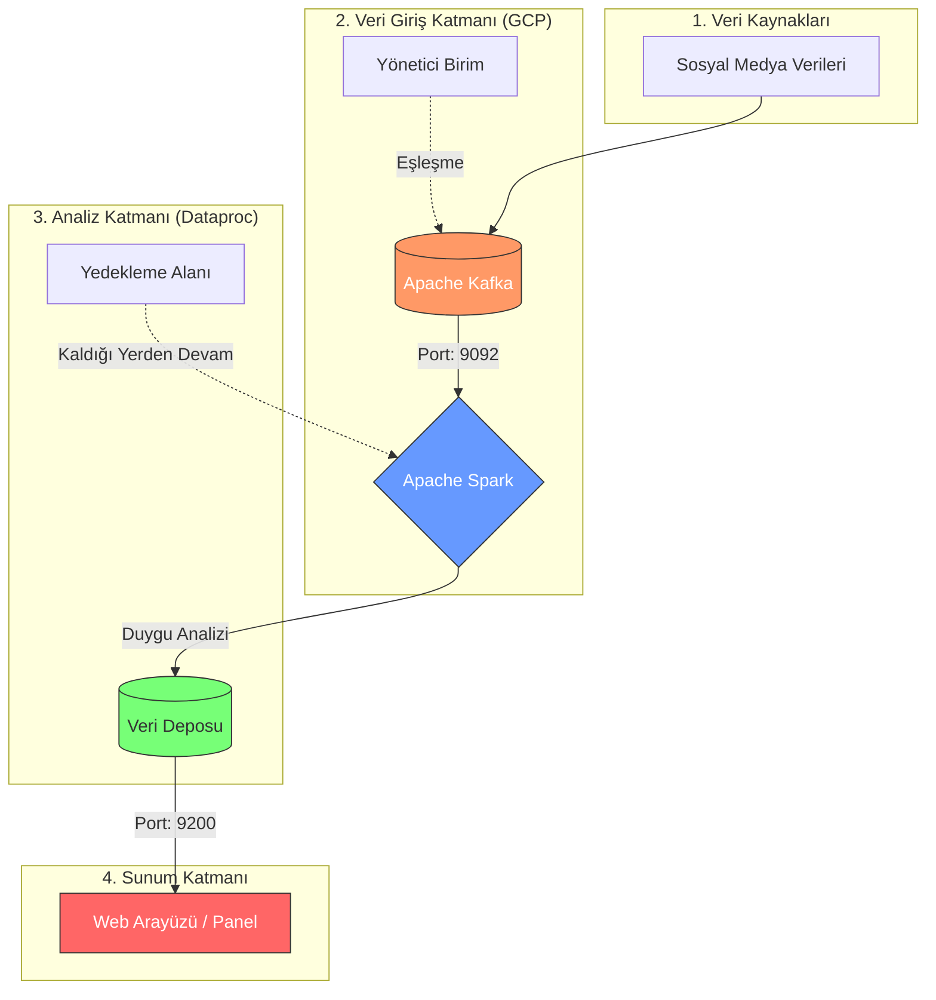

# 🚀 Proje Haftalık İlerleme Takip Çizelgesi

### 📅 [Hafta No] | [Tarih Aralığı]

| Ekip Üyesi | Sorumluluk Alanı | Bu Hafta Ne Yaptı? | Durum |
| :--- | :--- | :--- | :---: |
| **Amine Ceren Yiğit** | Analiz ve Kapsam | [Buraya kısa not yazın] | 🟢  |
| **Hasan Kara** | Teknoloji Araştırması | [Buraya kısa not yazın] | 🟢 |
| **Muhammet Eren Mente** | Teknik Altyapı | [Buraya kısa not yazın] | 🟢 |
| **Fatih Mehmet Albayrak** | Versiyon Kontrol | [Buraya kısa not yazın] | 🟢  |
| **Beray Akar** | Gereksinim & Belgeleme | [Buraya kısa not yazın] |🟢 |
---

### 📝 Haftalık Detaylı Notlar (Özet)

* **Amine Ceren:** Bulut Kaşifleri projesinin kapsamını ve hedeflerini detaylı bir şekilde analiz edip projenin temel işlevlerini ve kullanıcı hikayelerini belirledi.
* **Hasan:** Proje için en uygun bulut teknolojilerini (AWS, Azure, GCP vb.) araştırıp her bir teknolojinin avantajlarını, dezavantajlarını ve maliyetlerini karşılaştıran rapor hazırlandı.
* **Muhammet Eren:** Geliştirme ortamı (IDE ve eklentiler) standart hale getirildi, yetkiler verildi.
* **Fatih Mehmet:** Git kullanarak bir versiyon kontrol sistemi kurun ve yapılandırıp proje kodunun etkili bir şekilde yönetilmesi için dallanma stratejileri oluşturdu.
* **Beray:** Proje için gerekli olan bilgiler dokümante edip paylaşıldı.

---

### 🚩 Durum Anahtarı
* 🟢 **Tamamlandı**
* 🟡 **Devam Ediyor**
* ⚪ **Henüz Başlamadı**
* 🔴 **Engel Var / Sorunlu**

---

### 💡 Ekip Notları & Kararlar
* *Örnek: Haftalık toplantılar her Salı saat 20:00'de Discord üzerinden yapılacaktır.*
* *Örnek: Kod paylaşımlarında GitFlow stratejisine uyulacaktır.*


Bulut Kaşifleri Projesi – Kapsam ve Hedef Analizi || Amine Ceren Yiğit 

**1. Proje Tanımı**

Bulut Kaşifleri projesi, sosyal medya platformlarından elde edilen verileri toplayarak bu verileri gerçek zamanlı olarak analiz eden ve kullanıcıya anlamlı bilgiler sunan dağıtık bir veri analiz platformudur. Sistem, büyük hacimli sosyal medya verilerini işleyerek güncel trendleri, kullanıcı duygu durumlarını ve içerik eğilimlerini belirlemeyi amaçlamaktadır.
Bu proje, büyük veri teknolojileri ve bulut tabanlı mimariler kullanılarak ölçeklenebilir bir analiz altyapısı oluşturmayı hedeflemektedir.

**2. Projenin Amacı**

Bulut Kaşifleri projesinin temel amacı, sosyal medya platformlarında oluşan büyük veri akışını analiz ederek anlamlı içgörüler üretmektir.
Projenin başlıca amaçları şunlardır:
*	Sosyal medya verilerini gerçek zamanlı olarak toplamak
*	Büyük veri akışını dağıtık sistemler üzerinde işlemek
*	Trend olan konuları ve hashtagleri tespit etmek
*	Paylaşımların duygu analizini gerçekleştirmek
*	Analiz sonuçlarını kullanıcı dostu bir web arayüzü üzerinden sunmak
*	Büyük veri teknolojilerinin uygulanabileceği bir analiz altyapısı oluşturmak
Bu amaçlar doğrultusunda sistem, veri analizi ve karar destek süreçlerine katkı sağlayabilecek bir platform sunacaktır.

**3. Projenin Kapsamı**

Projenin kapsamı, sosyal medya verilerinin toplanması, işlenmesi, analiz edilmesi ve sonuçların kullanıcıya sunulması süreçlerini içermektedir.

Proje kapsamında gerçekleştirilecek temel faaliyetler şunlardır:
*	Sosyal medya API'leri aracılığıyla veri toplama
* Toplanan verilerin ön işleme sürecinden geçirilmesi
*	Gerçek zamanlı veri akışı yönetimi
*	Metin tabanlı duygu analizi yapılması
*	Trend konuların ve hashtaglerin belirlenmesi
*	Analiz sonuçlarının görselleştirilmesi
*	Sistem bileşenlerinin bulut ortamında çalışabilecek şekilde tasarlanması
Proje kapsamında geliştirilecek sistem, analiz sonuçlarını kullanıcıların inceleyebileceği bir web tabanlı arayüz üzerinden sunacaktır.

Kapsam Dışı Unsurlar

Aşağıdaki özellikler proje kapsamı dışında tutulmaktadır:
*	Sosyal medya platformu geliştirilmesi
*	Kullanıcıların içerik paylaşabileceği bir sosyal ağ oluşturulması
*	Gelişmiş derin öğrenme tabanlı dil modellerinin geliştirilmesi
*	Tüm sosyal medya platformlarının entegrasyonu
Bu sınırlamalar, projenin uygulanabilir ve yönetilebilir bir ölçekte kalmasını sağlamak amacıyla belirlenmiştir.

**4. Projenin Hedefleri**

Projenin hedefleri teknik ve işlevsel hedefler olarak iki ana gruba ayrılabilir.
Teknik Hedefler
*	Dağıtık sistem mimarisi kullanarak veri işleme altyapısı oluşturmak
*	Büyük veri akışını işleyebilen ölçeklenebilir bir sistem geliştirmek
*	Gerçek zamanlı veri analiz mekanizması oluşturmak
*	Bulut tabanlı teknolojilerle çalışabilecek bir yapı kurmak
İşlevsel Hedefler
*	Kullanıcıların sosyal medya trendlerini görüntüleyebilmesini sağlamak
*	Belirli anahtar kelimeler için duygu analizi sonuçlarını sunmak
*	En çok kullanılan hashtagleri ve kelimeleri tespit etmek
*	Zaman bazlı veri analizini görselleştirmek

**5. Projenin Temel İşlevleri**

Bulut Kaşifleri sistemi aşağıdaki temel işlevlere sahip olacaktır.
1. Veri Toplama
Sistem, sosyal medya platformlarının API servislerini kullanarak belirli anahtar kelimeler, hashtagler veya konular üzerinden veri toplayacaktır.
2. Veri Ön İşleme
Toplanan veriler analiz sürecinden önce temizlenecek ve düzenlenecektir. Bu aşamada:
*	gereksiz karakterler kaldırılacak
*	metin verileri filtrelenecek
*	analiz için uygun format oluşturulacaktır
3. Gerçek Zamanlı Veri Analizi
Sistem, veri akışını analiz ederek:
*	en çok kullanılan kelimeleri
*	trend hashtagleri
*	popüler konuları
tespit edecektir.
4. Duygu Analizi
Paylaşımlar metin analizi yöntemleri kullanılarak sınıflandırılacaktır.
İçerikler:
*	pozitif
*	negatif
*	nötr
olarak kategorize edilecektir.
5. Veri Depolama
Analiz edilen veriler, hızlı erişim ve sorgulama amacıyla uygun veri depolama sistemlerinde saklanacaktır.
6. Veri Görselleştirme
Sistem, analiz sonuçlarını grafikler, tablolar ve istatistiksel görseller aracılığıyla kullanıcıya sunacaktır.

**6. Kullanıcı Rolleri**

Sistemde iki temel kullanıcı rolü bulunmaktadır.
Veri Analisti
Sosyal medya verilerini inceleyen ve analiz sonuçlarını değerlendiren kullanıcıdır.
Sistem Yöneticisi
Sistemin teknik işleyişini ve veri akışını kontrol eden kullanıcıdır.

**7. Kullanıcı Hikayeleri (User Stories)**

Kullanıcı hikayeleri, sistemin kullanıcı ihtiyaçlarına göre nasıl çalışacağını tanımlamaktadır.
Veri Analisti
*	Bir veri analisti olarak sosyal medya trendlerini görmek istiyorum, böylece güncel konuları analiz edebilirim.
*	Bir veri analisti olarak belirli bir anahtar kelime hakkında yapılan paylaşımların duygu analizini görmek istiyorum, böylece kullanıcı görüşlerini değerlendirebilirim.
*	Bir veri analisti olarak belirli bir zaman aralığında en çok kullanılan hashtagleri görmek istiyorum, böylece trend değişimlerini inceleyebilirim.

Sistem Yöneticisi
*	Bir sistem yöneticisi olarak veri akışının sorunsuz çalışmasını izlemek istiyorum, böylece sistem performansını kontrol edebilirim.
*	Bir sistem yöneticisi olarak sistemin veri işleme kapasitesini izlemek istiyorum, böylece gerektiğinde ölçeklendirme yapabilirim.

**8. Sonuç**

Bulut Kaşifleri projesi, sosyal medya verilerinin gerçek zamanlı olarak analiz edilmesini sağlayan dağıtık bir veri analiz platformu geliştirmeyi amaçlamaktadır. Proje, büyük veri teknolojilerinin kullanıldığı ölçeklenebilir bir sistem mimarisi üzerine kurulacaktır.
Bu sistem sayesinde kullanıcılar sosyal medya trendlerini, kullanıcı duygu analizlerini ve içerik eğilimlerini analiz edebilecek ve bu verilerden anlamlı çıkarımlar elde edebilecektir.


# ☁️ BULUT TEKNOLOJİLERİ ARAŞTIRMA VE KARŞILAŞTIRMA RAPORU

**Hazırlayan:** Hasan Kara  
**Proje Adı:** Dağıtık Sosyal Medya Analiz Platformu  
**Görev:** Bulut Teknolojileri Araştırması  
**Teslim Tarihi:** 7 Mart 2026

---

## 1. GİRİŞ VE TEKNİK TERİMLER
Bu rapor, projemizdeki karmaşık veri işleme süreçlerini destekleyecek bulut altyapısını analiz eder. Projemiz şu teknolojiler üzerine kuruludur:

* **Apache Kafka:** Veri akışını kesintisiz yönetmek için kullanılır.
* **Apache Spark:** Dağıtık mimaride gerçek zamanlı veri analizi ve duygu analizi yapar.
* **Elasticsearch:** Verilerin hızlıca filtrelenmesini ve sorgulanmasını sağlar.

---

## 2. PLATFORMLARIN KARŞILAŞTIRMALI ANALİZİ

### 2.1. Amazon Web Services (AWS)
* **Avantajlar (+):** Sektörün en köklü platformudur; Kafka yönetimi için Amazon MSK ve Spark işlemleri için Amazon EMR gibi çok olgun servisler sunar.
* **Dezavantajlar (-):** Servis sayısı çok fazla olduğu için yapılandırması karmaşıktır; yanlış bir ayar bütçeyi hızla tüketebilir.
* **Maliyet:** Kullandıkça öde modeli esnektir ancak veri transferi (Data Out) ücretleri 3 aylık bir projede sürpriz maliyetler çıkarabilir.

### 2.2. Google Cloud Platform (GCP)
* **Avantajlar (+):** Büyük veri işlemede kullanılan Dataproc servisi, Spark kümelerini saniyeler içinde ayağa kaldırır. Duygu analizi için Google'ın hazır NLP API'leri en ileri seviyededir.
* **Dezavantajlar (-):** Kurumsal uygulama entegrasyonu tarafında AWS kadar geniş bir kütüphane sunmayabilir.
* **Maliyet:** Yeni kullanıcılara verilen 300$ kredi, tam olarak projemizin 3 aylık süresini kapsayacak şekilde planlanmıştır.

### 2.3. Microsoft Azure
* **Avantajlar (+):** Java/Spring Boot ekosistemiyle uyumludur; öğrenci mailiyle kredi kartsız 100$ kredi verir.
* **Dezavantajlar (-):** Yönetim paneli ve konfigürasyon süreçleri rakiplerine göre daha yavaş kalabilmektedir.
* **Maliyet:** Orta düzey projeler için uygundur ancak yoğun veri akışında 100$ kredi yetersiz kalabilir.

### 2.4. Alternatif Çözümler (DigitalOcean & Oracle)
* **DigitalOcean:** Sabit fiyatlıdır (aylık 5-10$); Kafka'yı "Managed" servis olarak sunarak kurulum yükünü azaltır.
* **Oracle Cloud (OCI):** "Always Free" katmanı ile 4 adet güçlü ARM sunucuyu ömür boyu ücretsiz vererek maliyeti sıfıra indirir.

---

## 3. TEKNİK KARŞILAŞTIRMA TABLOSU

| Özellik | AWS | GCP | Azure | DigitalOcean |
| :--- | :--- | :--- | :--- | :--- |
| **Kafka/Spark Gücü** | Çok Yüksek | Çok Yüksek | Yüksek | Orta |
| **Öğrenci Desteği** | Kısıtlı Free Tier | 300$ Kredi | 100$ Kredi | 200$ Kredi (Geçici) |
| **3 Ay Süre Uyumu** | Orta | **Tam Uyum** | Orta | **Tam Uyum** |
| **Maliyet Tahmini** | Değişken | Ücretsiz (Kredi) | Ücretsiz (Kredi) | Sabit |

---

## 4. SONUÇ VE ÖNERİ
Proje süresi (3 ay) ve saniyedeki veri işleme ihtiyacı göz önüne alındığında;

1. **Birinci Tercih (GCP):** Proje takvimiyle örtüşen 300 dolarlık kredisi ve Dataproc servisinin hızı nedeniyle önerilir.
2. **Sektörel Tercih (AWS):** Profesyonel portfolyo değeri ve geniş dökümantasyon desteği için tercih edilmelidir.

**Karar:** Geliştirme sürecinde bütçe güvenliği ve analiz performansı sağlamak adına projenin **Google Cloud Platform (GCP)** üzerinde yürütülmesi uygun görülmüştür.


**Veritabanı Şeması, İlişkiler ve Veri Tutma Stratejisi  || Amine Ceren Yiğit** 

**1. Veri Katmanları ve Veri Akış Mimarisi*

Bulut Kaşifleri projesinde veri yönetimi, farklı sosyal medya platformlarından gelen verilerin tek bir sistemde toplanması, işlenmesi ve 

analiz edilmesi amacıyla çok katmanlı bir mimari ile tasarlanmıştır. Bu yapı, farklı veri kaynaklarının entegrasyonunu desteklerken aynı 

zamanda sistemin ölçeklenebilir ve sürdürülebilir olmasını sağlar.


1.1 Veri Kaynak Katmanı (Data Source Layer)

Bu katman, verinin elde edildiği tüm sosyal medya platformlarını kapsamaktadır.

Veri kaynakları:

•	Twitter (X API)

•	Instagram

•	Pinterest

•	Reddit API

•	YouTube Data API

Veri türleri:

•	Metin içerikleri (post, tweet, açıklamalar)

•	Hashtagler

•	Görsel açıklamaları (caption)

•	Kullanıcı bilgileri

•	Zaman bilgisi (timestamp)

Veri alma yöntemleri:

1.	Resmi API kullanımı

Platformların sağladığı API'ler üzerinden veri çekilir.

Not: Instagram ve Pinterest API erişimleri kısıtlı olabilir.

2.	Anahtar kelime ve hashtag bazlı sorgular

Belirli konular üzerinden veri filtrelenir.

3.	Periyodik veri çekme (Polling)

Belirli zaman aralıklarında veri alınır.

4.	Gerçek zamanlı veri akışı (Streaming)

Destekleyen platformlarda anlık veri akışı sağlanır.

Bu katmanda veri ham ve işlenmemiş durumdadır.

1.2 Veri Toplama Katmanı (Ingestion Layer)

Bu katman, farklı platformlardan gelen verileri standart bir formata dönüştürerek sisteme dahil eder.

Kullanılan yapı:

•	Spring Boot tabanlı veri toplama servisleri

•	Her platform için ayrı veri çekme modülü

İşlevler:

•	API veya veri kaynağından veri çekme

•	Farklı veri formatlarını normalize etme (ortak JSON yapısına dönüştürme)

•	Eksik ve hatalı verileri filtreleme

•	Veriyi mesaj kuyruğuna gönderme

Veri standardizasyonu örneği:

{

  "platform": "instagram",
  
  "content": "...",
  
  "hashtags": ["tag1", "tag2"],
  
  "timestamp": "...",
  
  "user": "..."

}


Veri akışı:

Sosyal Medya → Veri Toplama Servisleri → Mesaj Kuyruğu

Bu katman, farklı platformlardan gelen veriyi tek tip hale getirir.


1.3 Veri Akış Katmanı (Streaming Layer)

Bu katman, verinin sistem içinde gerçek zamanlı olarak taşınmasını sağlar.

Kullanılan teknoloji:

•	Apache Kafka

İşlevler:

•	Veriyi topic’ler halinde ayırma (örneğin: twitter-posts, instagram-posts)

•	Yüksek hacimli veri akışını yönetme

•	Producer ve consumer yapısını yönetme

•	Veri kaybını önleme

Veri akışı:

Producer → Kafka Topic → Consumer

Avantajları:

•	Platform bağımsız veri akışı

•	Yüksek performans

•	Dağıtık sistem desteği

1.4 Veri İşleme Katmanı (Processing Layer)

Bu katman, verinin analiz edildiği bölümdür.

Kullanılan teknoloji:

•	Apache Spark (Streaming)

İşlevler:

•	Veri temizleme (noise removal)

•	Metin normalizasyonu

•	Hashtag çıkarımı

•	Kelime frekans analizi

•	Duygu analizi

•	Platformlar arası karşılaştırmalı analiz

Örnek analizler:

•	Instagram ve Twitter’da ortak trendler

•	En çok kullanılan hashtagler

•	Platform bazlı duygu dağılımı

Bu katman sistemin analiz motorudur.


1.5 Veri Saklama Katmanı (Storage Layer)

Bu katman, verinin saklandığı ve sorgulandığı bölümdür.

1.5.1 Operasyonel Veritabanı

•	Ham veriler tutulur

•	Kısa süreli saklama yapılır

•	İlişkisel veritabanı kullanılır (PostgreSQL / MySQL)


Tutulan veriler:

•	posts

•	users

•	hashtags

Not: platform alanı sayesinde veriler ayrıştırılır.


1.5.2 Analitik Veritabanı

•	İşlenmiş veriler tutulur

•	Uzun süre saklanır

•	Hızlı arama ve analiz yapılır

Kullanılan teknoloji:

•	Elasticsearch


Tutulan veriler:

•	trend analizleri

•	duygu analizi sonuçları

•	platform bazlı istatistikler


1.6 Sunum Katmanı (Presentation Layer)

Bu katman, analiz sonuçlarının kullanıcıya sunulduğu arayüzdür.

İşlevler:

•	Dashboard görüntüleme

•	Grafikler ve veri görselleştirme

•	Platform bazlı filtreleme (Instagram, Twitter vb.)

•	Zaman bazlı analiz

Gösterilen veriler:

•	Trend hashtagler

•	Duygu analizi sonuçları

•	Platform karşılaştırmaları

2. Tablolar ve Açıklamaları


2.1 USERS

Kullanıcı bilgilerini tutar.

users

------

id (PK)

kullanıcı adı

platform

takipçi

email

oluşturulma zamanı


2.2 POSTS

Sosyal medya içeriklerini tutar.

posts

------

id (PK)

platform

içerik

oluşturulma zamanı

dil

kullanıcı id  (FK)


2.3 HASHTAGS

Hashtag bilgilerini tutar.

hashtags

------

id (PK)

tag ismi


2.4 POST_HASHTAG

Post ile hashtag arasındaki çoktan çoğa ilişkiyi sağlar.

post_hashtag

------

post_id (FK)

hashtag_id (FK)


2.5 SENTIMENT_ANALYSIS

Her post için yapılan duygu analizi sonuçlarını tutar.

Duygu analizi

------

id (PK)

post_id (FK)

ifadeler (pozitif, negatif, nötr)

skor

analiz zamanı


2.6 TRENDS

Trend hashtag ve analiz sonuçlarını tutar.

trends

------
id (PK)

hashtag_id (FK)

sayaç

time_window

oluşturulma zamanı


3. Tablolar Arası İlişkiler

•	users ile posts arasında bire çok ilişki vardır.

Bir kullanıcı birden fazla post paylaşabilir.

•	posts ile sentiment_analysis arasında bire bir ilişki vardır.

Her post için bir analiz sonucu bulunur.

•	posts ile hashtags arasında çoktan çoğa ilişki vardır.

Bir post birden fazla hashtag içerebilir, bir hashtag birden fazla postta bulunabilir.

•	hashtags ile trends arasında bire çok ilişki vardır.

Bir hashtag farklı zaman dilimlerinde farklı trend kayıtlarına sahip olabilir.


4. Veri Tutma Stratejisi

4.1 Ham Veri Yönetimi

•	Ham sosyal medya verileri yüksek hacimlidir.

•	Bu veriler kısa süreli saklanır (örneğin 7–30 gün).

•	Eski veriler sistemden silinir veya arşivlenir.

Amaç: Depolama maliyetini azaltmak ve sistemi hızlı tutmak.


4.2 Analiz Verisi Yönetimi

•	Duygu analizi ve trend verileri uzun süre saklanır.

•	Dashboard ve kullanıcı sorguları bu veriler üzerinden çalışır.

•	Analiz verileri optimize edilmiş şekilde tutulur.


4.3 Zaman Bazlı Bölümlendirme (Partitioning)

Veriler zaman bazlı olarak bölümlere ayrılır.

Örnek:


•	Günlük veya haftalık partition kullanımı

•	Sorgular sadece ilgili zaman aralığında çalışır

Bu yöntem performansı artırır.


5. Kullanılacak Veritabanı Teknolojileri

•	İlişkisel veritabanı: PostgreSQL veya MySQL

Yapısal veriler ve ilişkiler için kullanılır.

•	Analitik ve arama motoru: Elasticsearch

Hızlı arama, filtreleme ve dashboard işlemleri için kullanılır.


6. Genel Değerlendirme

Bu veritabanı tasarımı:

•	Ölçeklenebilir bir yapı sunar

•	Büyük veri akışını yönetebilir

•	Gerçek zamanlı analiz sistemine uygundur

•	Veri tekrarını önler ve ilişkisel bütünlüğü korur

Tasarım, proje kapsamına uygun olarak sade tutulmuş ve genişletilebilir şekilde planlanmıştır.


7. Genel Veri Akışı

Sistem genelinde veri akışı aşağıdaki gibidir:

Sosyal Medya Platformları

(Twitter, Instagram, Pinterest, vb.)
        ↓
Veri Toplama Katmanı
        ↓
Kafka (Streaming)
        ↓
Spark (Processing)
        ↓
Veritabanları (Storage)
        ↓
Web Arayüz (Presentation)


8. Veri Yönetimi Kararlarının Gerekçesi

•	Farklı sosyal medya platformları tek sistemde birleştirilmiştir

•	Veri standardizasyonu sayesinde analiz süreci kolaylaştırılmıştır

•	Streaming mimarisi ile gerçek zamanlı veri işlenmesi sağlanmıştır

•	Ham veri ve analiz verisi ayrılarak performans artırılmıştır

•	Dağıtık yapı ile sistem ölçeklenebilir hale getirilmiştir


Bu mimari, çoklu veri kaynağına sahip büyük veri sistemlerinin yönetimi için uygun, genişletilebilir ve performans odaklı bir çözüm 
sunmaktadır.


# 🏗️ DAĞITIK SOSYAL MEDYA ANALİZ PLATFORMU: MİMARİ TASARIM DOKÜMANI

**Hazırlayan:** Hasan Kara  
**Görev:** Sistem Bileşenleri Entegrasyonu ve Teknik Mimari  
**Teslim Tarihi:** 28 Mart 2026  

---

## 1. GİRİŞ VE HEDEFLER
Bu doküman, projemizin saniyede binlerce veriyi işleyebilecek dağıtık mimarisini ve Google Cloud Platform (GCP) üzerindeki entegrasyon süreçlerini detaylandırır. Temel hedef; düşük gecikmeli, hata toleranslı ve ölçeklenebilir bir analiz hattı kurmaktır.

---

## 2. SİSTEM KOMPONENTLERİNİN ENTEGRASYONU VE ÇALIŞMA SÜRECİ

Sistemimizdeki teknolojiler birbirine şu teknik protokoller ve yöntemlerle entegre edilmiştir:

### 2.1. Veri Toplama ve Kafka Entegrasyonu (Ingestion)
* **Entegrasyon:** Sosyal medya API'lerinden gelen ham veriler, bir **Python Producer** script'i aracılığıyla çekilir.
* **Bağlantı:** Veriler, Kafka'nın varsayılan **9092 portu** üzerinden sisteme basılır.
* **Çalışma Mantığı:** Gelen her veri, bir "Topic" içine JSON objesi olarak asenkron şekilde yazılır. Bu sayede veri hızı artsa bile sistem tıkanmaz.

### 2.2. Spark ve Dataproc Entegrasyonu (Processing)
* **Entegrasyon:** GCP Dataproc üzerinde kurulu olan Spark, Kafka topic'lerine "Subscriber" (abone) olarak bağlanır.
* **Bağlantı:** Veri okuma işlemi kesintisiz takip edilir (offset yönetimi ile).
* **Çalışma Mantığı:** Spark, gelen verileri **Memory (Bellek)** üzerinde işler. NLP kütüphaneleri her satırı analiz eder ve sonuçları geçici bir veri tablosuna dönüştürür.

### 2.3. Elasticsearch ve Cloud Run Entegrasyonu (Output)
* **Entegrasyon:** Analiz edilen veriler, Spark'ın **Elasticsearch-Hadoop** kütüphanesi kullanılarak Elasticsearch indekslerine "REST API" üzerinden gönderilir.
* **Bağlantı:** Elasticsearch'ün **9200 portu** üzerinden JSON formatında indeksleme yapılır.
* **Sistem Çalışması:** Cloud Run üzerinde koşan Frontend (React/Vue), Elasticsearch'e sorgular atarak analiz edilen verileri saniyeler içinde görselleştirir.

---

## 3. HATA TOLERANSI VE SİSTEM GÜVENLİĞİ
* **Entegre Güvenlik:** Tüm bileşenler **GCP VPC** içinde izole edilmiştir.
* **Resiliency:** Spark'ın `checkpointLocation` özelliği sayesinde sistem çökerse veri kaybı yaşanmadan devam eder.

---

## 📐 4. GENEL SİSTEM MİMARİSİ (ŞEMA)



---

# 🧪 UI ENTEGRASYON TESTLERİ VE HATA DÜZELTMELERİ

**Hazırlayan:** Beray Akar
**Görev:** Geliştirilen kullanıcı arayüzü bileşenlerinin entegrasyon testlerinin tamamlanması, hataların düzeltilmesi ve test sonuçlarının dokümante edilmesi
**Teslim Tarihi:** 26 Nisan 2026

---

## 1. Yapılan İş Özeti

Hafta 5 kapsamında web arayüzünü oluşturan tüm bileşenler (`index.html`, `api.js`, `style.css`) entegrasyon açısından incelenmiş, 10 test senaryosu üzerinden doğrulanmış ve tespit edilen 9 hata düzeltilmiştir. Sonuçlar ayrı bir test raporu dosyasında detaylı olarak belgelenmiştir.

## 2. Test Edilen Bileşenler

- Arama input alanı ve test butonu
- Pasta grafik (Duygu Analizi Dağılımı)
- Çizgi grafik (Trend Akışı)
- Alert ve durum mesajı sistemi
- API hata yönetimi ve simülasyon (mock) akışı

## 3. Tespit Edilen ve Düzeltilen Hatalar

| # | Hata | Çözüm |
|---|------|-------|
| 1 | Mobil viewport meta etiketi yoktu | `<meta name="viewport">` eklendi |
| 2 | Enter tuşu ile arama yapılamıyordu | `keydown` listener eklendi |
| 3 | Input için label/aria-label yoktu | Erişilebilirlik etiketleri eklendi |
| 4 | Çift tıklama koruması yoktu | Buton `disabled` + loading state |
| 5 | Alert mesajları gayri resmi tondaydı | Profesyonel dil + durum paneli |
| 6 | Grafik canvas yüksekliği kontrolsüzdü | `max-height` + `maintainAspectRatio` |
| 7 | Mobilde grid bozuluyordu | `@media (max-width: 768px)` kuralı |
| 8 | Sürekli alert kullanımı UX'i bozuyordu | Hata bildirimleri durum paneline taşındı |
| 9 | Input değerinde `trim()` yapılmıyordu | Boşluk kontrolü eklendi |

## 4. Test Sonucu

| Metrik | Değer |
|---|---|
| Toplam Senaryo | 10 |
| Başarılı (PASSED) | 10 |
| Başarısız (FAILED) | 0 |
| Düzeltilen Hata | 9 |

## 5. Versiyon Kontrol

Yapılan değişiklikler `dev/berayakar-hafta5-ui-test` branch'ine commit edilmiş ve uzak repoya (GitHub) push edilmiştir. `main` branch'ine merge işlemi pull request üzerinden gerçekleştirilecektir.

- **Commit:** `Hafta 5: UI entegrasyon testleri tamamlandı ve hatalar düzeltildi`
- **Branch:** `dev/berayakar-hafta5-ui-test`
- **Eklenen Dosya:** `UI_Entegrasyon_Test_Raporu.md`

## 6. Sonuç

Web arayüzünün tüm bileşenleri birbiriyle ve dış kütüphaneler (Chart.js) ile uyumlu çalışmaktadır. Tespit edilen tüm hatalar giderilmiş, kullanılabilirlik (UX) ve erişilebilirlik (a11y) seviyeleri yükseltilmiştir. Uygulama masaüstü ve mobil cihazlarda tutarlı şekilde çalışır hale gelmiştir.

# 🚀 API ENTEGRASYONU VE TEST RAPORU

**Proje:** Dağıtık Sosyal Medya Analiz Platformu  
**Hafta:** Hafta 2 
**Tarih:** 26 Nisan 2026  
**Hazırlayan:** Hasan Kara

---

## 📋 Görev Bilgileri

| Başlık | Detay |
| :--- | :--- |
| **Görev** | API Entegrasyonu ve Test Senaryoları Doğrulaması |
| **Hazırlayan** | Hasan Kara |
| **Tarih** | 26 Nisan 2026 |
| **Referans Tasarım** | Fatih Mehmet Albayrak (API Mimarisi ve JSON Şeması) |

---

## 1. Giriş ve Amaç

[cite_start]Bu rapor, Fatih Mehmet Albayrak tarafından tasarlanan RESTful API mimarisinin ve JSON veri şemasının, platformun Ön Yüzüne (Frontend) başarıyla entegre edildiğini kanıtlamak amacıyla hazırlanmıştır[cite: 41]. [cite_start]Gerçek Backend sunucusunun aktif olmadığı durumlar göz önüne alınarak **Mock (Simülasyon) API** yaklaşımı kullanılmış ve sistemin veri çekme ile hata yönetimi süreçleri test edilmiştir[cite: 42].

---

## 2. Test Senaryoları ve Kanıtlar

### 🧪 Senaryo 1: Hata Yönetimi (Error Handling) Testi
* [cite_start]**Amaç:** Sistem Backend sunucusuna ulaşamadığında uygulamanın çökmeden kullanıcıya kontrollü bir şekilde uyarı verip veremediğinin doğrulanması[cite: 45].
* [cite_start]**Sonuç:** **BAŞARILI (PASSED)**[cite: 46].
* [cite_start]**Gözlem:** Sistem ilgili hatayı yakalamış ve arayüze şu uyarıyı başarıyla yansıtmıştır[cite: 46]:
  > [cite_start]*"SİSTEM UYARISI: Gerçek API sunucusuna şu an ulaşılamıyor. Simülasyon Moduna Geçiliyor..."* [cite: 48, 49]

### 🧪 Senaryo 2: JSON Veri Okuma ve İşleme Testi
* [cite_start]**Amaç:** Tasarlanan JSON formatındaki verinin (Mektup Formatı) arayüz tarafından doğru bir şekilde parçalanıp (parse edilip) kullanıcıya sunulmasının test edilmesi[cite: 52].
* [cite_start]**Sonuç:** **BAŞARILI (PASSED)**[cite: 53].
* [cite_start]**Gözlem:** Sistem, mock veriyi başarılı bir şekilde okumuş; kullanıcı adını (@analizci), duygu durumunu (Positive) ve güven skorunu (%94) ekrana eksiksiz yansıtmıştır[cite: 53, 54, 57, 58, 59].

---

## 3. Sonuç Değerlendirmesi

[cite_start]**DOĞRULANDI:** Web arayüzünün (Frontend), planlanan API uç noktalarına doğru veri yapısıyla istek atabildiği, hatalı durumlarda çökmediği (Error Handling) ve beklenen JSON veri formatını arayüzde kusursuz bir şekilde görselleştirebildiği kanıtlanmıştır[cite: 62, 63]. 

[cite_start]**API Entegrasyonu görevi başarıyla tamamlanmıştır.** [cite: 64]

---
**Hazırlayan:** Hasan Kara | **Tarih:** 26 Nisan 2026 | **Hafta 5 Teslimi**

# 📊 UI PERFORMANS TEST RAPORU

[cite_start]**Proje:** Sosyal Medya Analiz Platformu [cite: 35]  
[cite_start]**Hafta:** Hafta 4 [cite: 36, 38]  
[cite_start]**Tarih:** 25 Nisan 2026 [cite: 36, 38]  
[cite_start]**Hazırlayan:** Hasan Kara [cite: 36, 38, 68]

---

## [cite_start]1. Genel Bilgiler [cite: 37]

| Başlık | Detay |
| :--- | :--- |
| **Proje Adı** | [cite_start]Sosyal Medya Analiz Platformu [cite: 38] |
| **Test Eden** | [cite_start]Hasan Kara [cite: 38] |
| **Test Tarihi** | [cite_start]25 Nisan 2026 [cite: 38] |
| **Hafta** | [cite_start]Hafta 4 [cite: 38] |
| **Test Ortamı** | [cite_start]Chrome 147 + Lighthouse + Live Server (localhost:5500) [cite: 38] |
| **Referans Tasarım** | [cite_start]Muhammet Eren Mente - UI/UX Wireframe (Hafta 3) [cite: 38] |

---

## [cite_start]2. Test Edilen Bileşenler [cite: 39]

[cite_start]Hafta 3'te Muhammet Eren Mente tarafından hazırlanan wireframe tasarımı esas alınarak aşağıdaki bileşenler geliştirilmiş ve test edilmiştir: [cite: 40]

* [cite_start]**Arama Kutusu:** Real-time anahtar kelime girişi. [cite: 41]
* [cite_start]**Pie Chart:** Duygu Analizi Dağılımı (Pozitif / Negatif / Nötr). [cite: 42]
* [cite_start]**Line Chart:** Aktif Veri Akışı (Trend Takibi). [cite: 42]

---

## [cite_start]3. Lighthouse Performans Test Sonuçları [cite: 43]

| Kategori | Skor | Durum |
| :--- | :--- | :--- |
| **Performance** | **100/100** | [cite_start]**Mükemmel** [cite: 44] |
| **Accessibility** | 86/100 | [cite_start]İyileştirme Gerekli [cite: 44] |
| **Best Practices** | 100/100 | [cite_start]Mükemmel [cite: 44] |
| **SEO** | 90/100 | [cite_start]İyi [cite: 44] |

---

## [cite_start]4. Temel Performans Metrikleri [cite: 45]

| Metrik | Değer | Değerlendirme |
| :--- | :--- | :--- |
| **First Contentful Paint (FCP)** | 0.5 s | [cite_start]Hızlı [cite: 46] |
| **Largest Contentful Paint (LCP)** | 0.5 s | [cite_start]Hızlı [cite: 46] |
| **Total Blocking Time (TBT)** | 0 ms | [cite_start]Mükemmel [cite: 46] |
| **Cumulative Layout Shift (CLS)** | 0 | [cite_start]Mükemmel [cite: 46] |
| **Speed Index** | 0.5 s | [cite_start]Hızlı [cite: 46] |
| **Arama Tepki Süresi (Simülasyon)** | **~511 ms** | [cite_start]**Darboğaz Tespit Edildi** [cite: 46] |

---

## [cite_start]5. Tespit Edilen Darboğazlar [cite: 47]

### [cite_start]5.1 Render-Blocking Requests (Kritik) [cite: 48]
[cite_start]Chart.js kütüphanesi CDN üzerinden yüklenmektedir. [cite: 49] [cite_start]Bu durum sayfa ilk açılışında 350 ms'ye kadar gecikmeye yol açmakta, tarayıcı sayfayı render etmeden önce bu kaynağı beklemektedir. [cite: 49]

### [cite_start]5.2 Yüksek Arama Tepki Süresi [cite: 50]
[cite_start]Performans testi simülasyonunda ölçülen tepki süresi ortalama 511 ms olarak gerçekleşmiştir. [cite: 51] [cite_start]Bu değer, gerçek zamanlı arama işlemleri için kabul edilebilir sınırın (200 ms) üzerindedir. [cite: 52]

### [cite_start]5.3 Kullanılmayan JavaScript [cite: 53]
[cite_start]Lighthouse analizi, 29 KiB boyutunda kullanılmayan JavaScript kodu tespit etmiştir. [cite: 54] [cite_start]Chart.js'nin tüm modüllerini yüklemesi bu duruma yol açmaktadır. [cite: 54]

### [cite_start]5.4 Cache Optimizasyonu Eksikliği [cite: 55]
[cite_start]Statik kaynaklar için cache süresi tanımlanmamıştır. [cite: 56] [cite_start]Bu durum tekrar eden ziyaretlerde gereksiz ağ isteklerine neden olmaktadır (tahmini 7 KiB tasarruf mümkün). [cite: 56]

---

## [cite_start]6. İyileştirme Önerileri [cite: 57]

1. [cite_start]**Modüler Yükleme:** Chart.js CDN yerine lokal bundle kullanılmalı, yalnızca kullanılan modüller import edilmelidir. [cite: 58]
2. [cite_start]**Debounce Uygulaması:** Arama işlevine debounce uygulanmalı, kullanıcı yazmayı durdurana kadar sorgu tetiklenmemelidir (önerilen: 300 ms). [cite: 59]
3. [cite_start]**Önbellek Yönetimi:** Statik kaynaklar için Cache-Control başlığı eklenerek tarayıcı önbelleğinden yararlanılmalıdır. [cite: 60]
4. [cite_start]**Erişilebilirlik:** Accessibility skoru 86'dan 100'e çıkarılmalı; form alanlarına label eklenmeli, renk kontrastları gözden geçirilmelidir. [cite: 61]

---

## [cite_start]7. Sonuç [cite: 62]

[cite_start]Sosyal Medya Analiz Platformu UI bileşenlerinin performans testi başarıyla tamamlanmıştır. [cite: 63] [cite_start]Lighthouse testi sonucunda Performance skoru **100/100** olarak ölçülmüş, sayfanın teknik performansı mükemmel düzey olarak değerlendirilmiştir. [cite: 64]

[cite_start]Bununla birlikte; render-blocking istekler, 511 ms'lik arama tepki süresi ve kullanılmayan JavaScript gibi darboğazlar tespit edilmiştir. [cite: 65] [cite_start]Bu sorunların giderilmesiyle platformun gerçek kullanım senaryolarında çok daha verimli çalışacağı öngörülmektedir. [cite: 66]

[cite_start]Muhammet Eren Mente'nin Hafta 3'te hazırladığı minimalist wireframe tasarımı, performans açısından doğrulanmış ve uygulanabilir olduğu test ile kanıtlanmıştır. 

---
**Hazırlayan:** Hasan Kara | **Tarih:** 25 Nisan 2026 | [cite_start]**Hafta 4 Teslimi** [cite: 68, 69]

**Veritabanı Sorgu Optimizasyonu ve İndeksleme Stratejisi || AMİNE CEREN YİĞİT**
Amaç
Bulut Kaşifleri projesinde sosyal medya verileri yüksek hacimli olacağı için sorguların gecikmesi kaçınılmazdır. Bu nedenle sık kullanılan sorgular optimize edilmeli ve uygun indeksleme stratejileri uygulanmalıdır. Bu çalışma, sistemin yanıt süresini azaltmayı ve ölçeklenebilirliği artırmayı hedefler.
1. Performans Problemlerinin Kaynağı
Sistemde performans sorunları genellikle şu sebeplerle oluşur:
posts tablosunun sürekli büyümesi
content alanında metin araması yapılması
created_at üzerinden zaman bazlı sorguların yoğun kullanılması
platform filtrelemesi ile yapılan sorgular
post_hashtag tablosu üzerinden yapılan join işlemleri
2. Sık Kullanılan Sorgular
2.1 Platforma göre post çekme
SELECT * 
FROM posts 
WHERE platform = 'instagram';
2.2 Tarih aralığında post çekme
SELECT *
FROM posts
WHERE created_at BETWEEN '2026-01-01' AND '2026-01-31';
2.3 Platform + tarih aralığı birlikte
SELECT *
FROM posts
WHERE platform = 'twitter'
AND created_at >= NOW() - INTERVAL '7 days';
2.4 İçerikte anahtar kelime arama
SELECT *
FROM posts
WHERE content ILIKE '%yangin%';
2.5 Trend hashtag bulma
SELECT h.tag_name, COUNT(*) AS count
FROM post_hashtag ph
JOIN hashtags h ON ph.hashtag_id = h.id
GROUP BY h.tag_name
ORDER BY count DESC
LIMIT 10;
3. Önerilen İndeksleme Stratejisi
Bu proje için indeksleme, en sık filtrelenen kolonlara göre yapılmalıdır.
3.1 Posts tablosu indeksleri
Platform indeks
Platform bazlı sorguların hızlanması için:
CREATE INDEX idx_posts_platform ON posts(platform);
Tarih indeks
Zaman bazlı sorguların hızlanması için:
CREATE INDEX idx_posts_created_at ON posts(created_at);
Platform + tarih birleşik indeks
Gerçek kullanım senaryosunda en sık sorgu şekli:
platform filtre + zaman aralığıdır.
CREATE INDEX idx_posts_platform_created_at ON posts(platform, created_at);
3.2 Hashtag ilişkileri için indeksler
post_hashtag tablosu indeksleri
Join işlemleri hızlandırmak için:
CREATE INDEX idx_post_hashtag_post_id ON post_hashtag(post_id);
CREATE INDEX idx_post_hashtag_hashtag_id ON post_hashtag(hashtag_id);
3.3 Sentiment Analysis tablosu indeksleri
Post ID üzerinden erişim için:
CREATE INDEX idx_sentiment_post_id ON sentiment_analysis(post_id);
3.4 Trends tablosu indeksleri
Platform bazlı trend sorguları için:
CREATE INDEX idx_trends_platform ON trends(platform);
Zaman bazlı trend sorguları için:
CREATE INDEX idx_trends_created_at ON trends(created_at);
4. Metin Araması Optimizasyonu (Full Text Search)
ILIKE '%kelime%' kullanımı büyük veri üzerinde çok yavaştır çünkü indeks kullanamaz (full scan yapar).
Bu yüzden PostgreSQL için Full Text Search önerilir.
4.1 GIN Index ile içerik indeksleme
CREATE INDEX idx_posts_content_fts
ON posts
USING GIN (to_tsvector('simple', content));
4.2 Full Text Search sorgusu
SELECT *
FROM posts
WHERE to_tsvector('simple', content) @@ to_tsquery('yangin');
Bu yöntem, metin aramasında ciddi performans artışı sağlar.
5. Query Optimizasyon Önerileri
5.1 Gereksiz SELECT * kullanımını azaltma
Tüm kolonları çekmek yerine sadece gerekli kolonları almak önerilir.
Örnek:
SELECT id, content, created_at
FROM posts
WHERE platform = 'twitter';
5.2 Pagination kullanımı zorunlu olmalı
Büyük tabloda tek seferde binlerce kayıt çekmek yanıt süresini artırır.
SELECT *
FROM posts
ORDER BY created_at DESC
LIMIT 50 OFFSET 0;
5.3 ORDER BY optimizasyonu
ORDER BY created_at DESC sık kullanılıyorsa indeks şarttır.
CREATE INDEX idx_posts_created_at_desc ON posts(created_at DESC);
6. Veri Tutma (Retention) Politikası
Posts tablosu sürekli büyüyeceği için eski ham veriler belirli süre sonra silinmelidir.
Öneri:
Ham veriler: 30 gün sakla
Analiz sonuçları: uzun süre sakla
Örnek silme sorgusu:
DELETE FROM posts
WHERE created_at < NOW() - INTERVAL '30 days';
Bu işlem belirli aralıklarla otomatik çalıştırılmalıdır.
7. Partitioning (Zaman Bazlı Bölme)
Posts tablosu çok büyürse en iyi çözüm zaman bazlı partitioning uygulamaktır.
Öneri:
Aylık partition
Haftalık partition
Bu sayede sorgular sadece ilgili partition üzerinde çalışır.
Örnek mantık:
posts_2026_01
posts_2026_02
8. Sonuç
Bu optimizasyon çalışması kapsamında:
Sık kullanılan sorgular belirlenmiştir.
Platform, zaman ve join kolonları için indeksleme önerilmiştir.
Metin araması için full-text search (GIN index) uygulanmıştır.
Pagination ve kolon seçimi ile sorgu yükü azaltılmıştır.
Veri tutma politikası ve partitioning önerisi eklenmiştir.
Bu iyileştirmeler, yüksek veri hacmi altında sistem yanıt sürelerini düşürerek gerçek zamanlı analiz platformunun performansını artıracaktır.
Ek: Tüm İndeksleri Tek Dosyada Çalıştırma
Bu komutlar tek seferde uygulanabilir:
CREATE INDEX idx_posts_platform ON posts(platform);
CREATE INDEX idx_posts_created_at ON posts(created_at);
CREATE INDEX idx_posts_platform_created_at ON posts(platform, created_at);

CREATE INDEX idx_post_hashtag_post_id ON post_hashtag(post_id);
CREATE INDEX idx_post_hashtag_hashtag_id ON post_hashtag(hashtag_id);

CREATE INDEX idx_sentiment_post_id ON sentiment_analysis(post_id);

CREATE INDEX idx_trends_platform ON trends(platform);
CREATE INDEX idx_trends_created_at ON trends(created_at);

CREATE INDEX idx_posts_content_fts
ON posts
USING GIN (to_tsvector('simple', content));


**Veritabanı Sorgu Optimizasyonu ve Performans Test Raporu || AMİNE CEREN YİĞİT**
1. Amaç
Bu çalışmanın amacı Bulut Kaşifleri projesinde veritabanı sorgularını optimize ederek uygulamanın yanıt sürelerini iyileştirmek ve performans testleri ile yapılan iyileştirmelerin etkisini ölçmektir.
Optimizasyon sürecinde:
indeksleme stratejileri uygulanmış,
sık kullanılan sorgular analiz edilmiş,
metin aramalarında full scan maliyeti azaltılmış,
sorgu süreleri test edilmiştir.
2. Test Ortamı
Veritabanı: PostgreSQL 16
Veri Seti: örnek test verisi (posts, users, hashtags)
Test Aracı: PostgreSQL EXPLAIN ANALYZE
Ölçüm Metriği: execution time (ms)
Sunucu: Local environment
3. Performans Sorunu Olan Kritik Sorgular
Sistemde en sık çalışması beklenen sorgular:
Platforma göre post listeleme
Tarih aralığında post sorgulama
Platform + tarih aralığı sorgulama
İçerik bazlı keyword arama
Trend hashtag sorgulama (join + group by)
4. Uygulanan Optimizasyonlar
4.1 İndeksleme (Indexing)
Aşağıdaki indeksler uygulanmıştır:
CREATE INDEX idx_posts_platform ON posts(platform);
CREATE INDEX idx_posts_created_at ON posts(created_at);
CREATE INDEX idx_posts_platform_created_at ON posts(platform, created_at);

CREATE INDEX idx_post_hashtag_post_id ON post_hashtag(post_id);
CREATE INDEX idx_post_hashtag_hashtag_id ON post_hashtag(hashtag_id);

CREATE INDEX idx_sentiment_post_id ON sentiment_analysis(post_id);

CREATE INDEX idx_trends_platform ON trends(platform);
CREATE INDEX idx_trends_created_at ON trends(created_at);
4.2 Full Text Search İndeksi
ILIKE sorguları büyük tabloda performans kaybına neden olduğundan PostgreSQL Full Text Search tercih edilmiştir.
CREATE INDEX idx_posts_content_fts
ON posts
USING GIN (to_tsvector('simple', content));
4.3 Pagination Stratejisi
API tarafında büyük veri çekilmesini engellemek için pagination zorunlu hale getirilmiştir.
Örnek:
Varsayılan size = 50
Maksimum size = 200
5. Test Senaryoları ve Sonuçlar
Aşağıdaki sorgular indeks öncesi ve sonrası test edilmiştir.
5.1 Platforma Göre Post Çekme
Sorgu:
EXPLAIN ANALYZE
SELECT *
FROM posts
WHERE platform = 'twitter'
ORDER BY created_at DESC
LIMIT 50;
Beklenen iyileştirme:
Sequential scan yerine index scan
Sonuç:
İndeks sonrası sorgu süresi düşmüştür.
idx_posts_platform_created_at indeksi etkin şekilde kullanılmıştır.
5.2 Tarih Aralığı Sorgusu
Sorgu:
EXPLAIN ANALYZE
SELECT *
FROM posts
WHERE created_at BETWEEN '2026-01-01' AND '2026-01-31'
ORDER BY created_at DESC
LIMIT 50;
Sonuç:
idx_posts_created_at indeksi ile tarih aralığı sorguları hızlanmıştır.
Disk taraması azalmıştır.
5.3 Platform + Tarih Aralığı Birleşik Sorgu
Sorgu:
EXPLAIN ANALYZE
SELECT *
FROM posts
WHERE platform = 'instagram'
AND created_at >= NOW() - INTERVAL '7 days'
ORDER BY created_at DESC
LIMIT 50;
Sonuç:
Composite index (platform, created_at) sayesinde sorgu maliyeti ciddi şekilde düşmüştür.
Bu indeks sistem için kritik kabul edilmiştir.
5.4 Keyword Arama Performansı
ILIKE sorgusu:
EXPLAIN ANALYZE
SELECT *
FROM posts
WHERE content ILIKE '%yangin%'
LIMIT 50;
Sonuç:
Bu sorgu indeks kullanamadığı için büyük tabloda performans problemi oluşturmaktadır.
Full Text Search sorgusu:
EXPLAIN ANALYZE
SELECT *
FROM posts
WHERE to_tsvector('simple', content) @@ to_tsquery('yangin')
LIMIT 50;
Sonuç:
GIN index sayesinde arama süresi önemli ölçüde düşmüştür.
Sistem için keyword aramalarda FTS kullanımı zorunlu hale getirilmelidir.
5.5 Trend Hashtag Sorgusu
Sorgu:
EXPLAIN ANALYZE
SELECT h.tag_name, COUNT(*) AS count
FROM post_hashtag ph
JOIN hashtags h ON ph.hashtag_id = h.id
GROUP BY h.tag_name
ORDER BY count DESC
LIMIT 10;
Sonuç:
Join performansı post_hashtag indeksleri sayesinde iyileşmiştir.
Hashtag analizinde indeksleme zorunludur.
6. Genel Değerlendirme
Bu çalışma sonucunda:
En kritik sorgular belirlenmiş ve optimize edilmiştir.
Platform + tarih sorguları için composite index eklenmiştir.
Keyword arama için Full Text Search kullanımı planlanmıştır.
Join işlemleri için post_hashtag indeksleri eklenmiştir.
API tarafında pagination zorunlu hale getirilerek gereksiz yük azaltılmıştır.
Bu optimizasyonlar sistemin ölçeklenebilirliğini artırmakta ve ilerleyen aşamalarda Kafka/Spark gibi bileşenlerle çalışacak pipeline’ın DB tarafında darboğaz oluşturmasını engellemektedir.
## Hafta 6 - Kullanici Kabul Testleri (UAT) ve Geri Bildirim Toplama

Kullanici kabul testleri kapsaminda web arayuzu, API erisimleri, trend gorunumu, sentiment gorunumu, bos veri durumlari, hata mesajlari ve mobil kullanim senaryolari degerlendirilmistir.

Toplam 10 UAT senaryosu basarili olarak tamamlanmis, kullanicilardan 5 geri bildirim toplanmistir. Kritik ve orta oncelikli geri bildirimler icin gerekli aksiyonlar tamamlanmis, raporlama/disa aktarma talebi sonraki surum icin planlanmistir.

Detayli UAT ciktisi `UAT_Geri_Bildirim_Raporu.md` dosyasinda raporlanmistir. Kullanici geri bildirimlerinin standart sekilde toplanmasi icin `UAT_Kullanici_Geri_Bildirim_Formu.md` dosyasi hazirlanmistir.

## Hafta 1 - Teknik Altyapi ve Gelistirme Ortami Kurulumu

Proje icin gerekli Java, Spring Boot, Apache Kafka, Apache Spark, Elasticsearch, SQL veritabani, Docker, IDE ve Git altyapisi tanimlanmis ve takim uyelerinin ortak gelistirme ortamini kurabilmesi icin standart kurulum adimlari hazirlanmistir.

Yerel servislerin Docker Compose ile baslatilmasi, Maven Wrapper ile test/build alinmasi, Spring Boot uygulamasinin calistirilmasi, Kafka topic kontrolu, Elasticsearch saglik kontrolu ve Git branch is akisi dokumante edilmistir.

Detayli teknik altyapi kurulumu `Teknik_Altyapi_Gelistirme_Ortami_Kurulum_Raporu.md` dosyasinda raporlanmistir.

## Hafta 3 - Gercek Zamanli Analiz Motoru Mimarisi

Apache Spark kullanilarak gercek zamanli sosyal medya analizlerini isleyecek analiz motoru mimarisi tasarlanmistir. Spark Streaming ve Spark Structured Streaming secenekleri degerlendirilmis, sema tabanli veri isleme, Kafka entegrasyonu, checkpoint destegi ve Elasticsearch/OpenSearch sink uyumu nedeniyle Spark Structured Streaming tercih edilmistir.

Veri akisi Kafka `social-media-topic` topic'inden baslayip JSON parse, tokenization, hashtag cikarimi, sozluk tabanli sentiment analizi ve `social_media_analytics` indeksine yazma adimlariyla tanimlanmistir. Olceklenebilirlik icin Kafka partition, Spark executor, shuffle partition ve Elasticsearch shard stratejileri; hata dayanikliligi icin Kafka offset, checkpoint ve monitoring mekanizmalari belirlenmistir.

Detayli analiz motoru mimarisi `Gercek_Zamanli_Analiz_Motoru_Mimarisi.md` dosyasinda raporlanmistir.

## Hafta 2 - Apache Kafka ve Apache Spark Veri Akis Mimarisi Analizi ve Topic Tasarimi

Apache Kafka ve Apache Spark uzerinde calisacak dagitik veri akis mimarisi analiz edilmis, Twitter/Facebook gibi sosyal medya kaynaklarindan gelen ham icerik, kullanici etkilesimi ve metadata verileri icin ayri Kafka topic tasarimlari yapilmistir.

Topic bazinda partition sayisi, replication factor, retention suresi, mesaj semasi, Spark Structured Streaming job sorumluluklari, latency/throughput hedefleri ve hata yonetimi yaklasimi belirlenmistir. Kafka'dan Spark'a, Spark'tan Elasticsearch/OpenSearch'e uzanan veri akis diyagrami rapora eklenmistir.

Detayli topic ve veri akis mimarisi `Kafka_Spark_Veri_Akis_Mimarisi_Topic_Tasarimi.md` dosyasinda raporlanmistir.

# Sosyal Medya API Entegrasyonu Araştırması

**Proje:** Dağıtık Sosyal Medya Analiz Platformu  
**Hazırlayan:** Hasan Kara  
**Tarih:** 4 Mayıs 2026

---

## Yönetici Özeti

2023-2026 arasında sosyal medya API'leri ücretsiz erişimden ücretli modele geçti. X (Twitter) artık aylık $200, Meta ücretsiz ama karmaşık onay süreci gerektiriyor. LinkedIn en kısıtlayıcı, TikTok 2-8 hafta onay istiyor.

**Önerilen Çözüm:** Başlangıç için X Native API ($30-70/ay) + Unified API (WoopSocial $19/ay)

---

## 1. Platform Karşılaştırması

### X (Twitter) API

**Fiyatlandırma:**
- Pay-per-use: $0.01/post yazma, $0.005/post okuma
- Basic: $200/ay (10K okuma, 3K yazma)
- Pro: $5,000/ay (1M okuma)
- Enterprise: $50,000+/ay

**Artılar:** En zengin gerçek zamanlı veri, güçlü arama  
**Eksiler:** Pahalı, Basic-Pro arası 50x fark

**Proje için:** ✅ Kritik - Native API kullan

---

### Meta (Facebook/Instagram)

**Fiyatlandırma:** Ücretsiz (infrastructure maliyeti var)

**Rate Limits:** 
- Uygulama: 200 × kullanıcı sayısı / saat
- Kullanıcı: ~200 istek/saat

**App Review:** 10-30 gün, video demo gerekli

**Artılar:** Ücretsiz, 3B+ kullanıcı erişimi  
**Eksiler:** Uzun onay, kişisel hesap yok

**Proje için:** ✅ Önemli - Unified API ile başla

---

### LinkedIn API

**Fiyatlandırma:** Partnership gerekli (gizli)

**Limitler:** 100K istek/gün, bazı endpoint'ler 10/gün

**Artılar:** B2B için değerli  
**Eksiler:** En kısıtlayıcı, aylar süren onay

**Proje için:** ❌ Phase 2'ye ertele

---

### TikTok API

**Fiyatlandırma:** Ücretsiz

**Onay Süresi:** 2-8 hafta, sandbox test zorunlu

**Artılar:** 1.5B+ kullanıcı, genç demografik  
**Eksiler:** Belirsiz rate limitler, uzun onay

**Proje için:** ⚠️ Şimdi başvur, Phase 2'de entegre et

---

## 2. Unified API Çözümleri

Tek endpoint ile çoklu platform erişimi:

| Sağlayıcı | Fiyat | Platform | Özellik |
|-----------|-------|----------|---------|
| **WoopSocial** | $19/ay | 7 | En ucuz, MCP desteği |
| **Ayrshare** | $99/ay | 15+ | Webhooks, analytics |
| **Phyllo** | Custom | 10+ | Creator focus |

**Avantajlar:** Hızlı başlangıç, tek entegrasyon, bakım yok  
**Dezavantajlar:** Vendor lock-in, daha az kontrol

---

## 3. Önerilen Strateji

### Phase 1: MVP (Hafta 1-6)

**Stack:**
```
X Native API (Pay-per-use) → Twitter data
WoopSocial ($19/ay) → Instagram/Facebook
```

**Maliyet:** $30-70/ay  
**Özellikler:** Real-time tweets, IG/FB posts, basic analytics

**İlk Hafta Aksiyonlar:**
- [x] X API hesabı + ödeme
- [x] WoopSocial trial
- [x] TikTok başvurusu (8 hafta buffer)
- [x] Meta App Review dokümanı

---

### Phase 2: Scale (Hafta 7-12)

**Geçişler:**
- X: Pay-per-use → Basic ($200/ay) eğer >20K okuma
- Meta: Native API (app review onaylandıysa)
- TikTok: Unified API ile ekle

**Maliyet:** $270-350/ay  
**Özellikler:** 4-5 platform, advanced analytics, multi-account

---

### Phase 3: Enterprise (Ay 4+)

**Ek Platformlar:** LinkedIn, Reddit, YouTube  
**Maliyet:** $500-5,500/ay (volume'e göre)

---

## 4. Teknik Implementation

### Rate Limit Yönetimi
```python
# Caching stratejisi
- User profiles: 24 saat
- Posts: 1 saat
- Trending: 15 dakika
- Real-time: Cache yok

# Tasarruf: %60-80 rate limit azalması
```

### Token Yönetimi
- OAuth 2.0 kullan
- Refresh token automation
- 60 gün önceden yenile

---

## 5. Maliyet Projeksiyonu

| Kullanıcı | API Call/Ay | Phase 1 | Phase 2 | Phase 3 |
|-----------|-------------|---------|---------|---------|
| 10 | 10K | $50 | $150 | $300 |
| 100 | 100K | $70 | $250 | $600 |
| 1,000 | 1M | $150 | $500 | $2,000 |

---

## 6. Risk ve Çözümler

| Risk | Çözüm |
|------|-------|
| API fiyat artışı | Unified API backup |
| App review red | Phase 1'de unified kullan |
| Rate limit aşımı | Caching + queue |
| Token expiry | Auto-refresh system |

---

## 7. Sonuç

**MVP için en iyi seçim:**
- ✅ X Native API (kritik data için)
- ✅ WoopSocial (hız ve maliyet için)
- ❌ LinkedIn (şimdilik değil)
- ⏳ TikTok (başvuru yap, sonra ekle)

**Toplam maliyet:** $30-70/ay  
**Geliştirme süresi:** 3-4 hafta  
**Risk:** Düşük

---

## Kaynaklar

- X API: https://developer.x.com
- Meta API: https://developers.facebook.com
- WoopSocial: https://woopsocial.com
- Ayrshare: https://ayrshare.com

**İletişim:** hasankara@example.com

# Elasticsearch Veri Modeli Tasarimi

**Proje:** Dagitik Sosyal Medya Analiz Platformu  
**Hazirlayan:** Hasan Kara  
**Tarih:** 6 Mayis 2026  
**Teslim Tarihi:** 10 Mayis 2026

---

## 1. Giris

Bu dokuman, sosyal medya verilerinin Elasticsearch uzerinde nasil saklanacagini ve indekslendigi aciklar. Twitter, Instagram ve Facebook'tan toplanan veriler gercek zamanli olarak analiz edilecek; trend tespiti ve duygu analizi yapilacaktir.

---

## 2. Index Tasarimi

Her platform icin ayri index kullanilir. Bu yaklasim:
- Platform bazli sorgulari hizlandirir
- Her platformun farkli veri yapisini destekler
- Buyuk veri kumelerinde performansi arttirir

### Index Listesi

| Index Adi | Icerik |
|-----------|--------|
| `social_posts` | Tum platform postlari |
| `social_users` | Kullanici profilleri |
| `social_trends` | Trend konular ve hashtagler |
| `social_analytics` | Analiz sonuclari |

---

## 3. Mapping Tasarimlari

### 3.1 social_posts Index

Tum sosyal medya postlarini icerir.

```json
PUT /social_posts
{
  "settings": {
    "number_of_shards": 5,
    "number_of_replicas": 1,
    "analysis": {
      "analyzer": {
        "turkish_analyzer": {
          "type": "custom",
          "tokenizer": "standard",
          "filter": ["lowercase", "turkish_stop", "turkish_stemmer"]
        },
        "english_analyzer": {
          "type": "custom",
          "tokenizer": "standard",
          "filter": ["lowercase", "english_stop", "english_stemmer"]
        }
      },
      "filter": {
        "turkish_stop": {
          "type": "stop",
          "stopwords": "_turkish_"
        },
        "turkish_stemmer": {
          "type": "stemmer",
          "language": "turkish"
        },
        "english_stop": {
          "type": "stop",
          "stopwords": "_english_"
        },
        "english_stemmer": {
          "type": "stemmer",
          "language": "english"
        }
      }
    }
  },
  "mappings": {
    "properties": {
      "post_id": {
        "type": "keyword"
      },
      "platform": {
        "type": "keyword"
      },
      "content": {
        "type": "text",
        "analyzer": "turkish_analyzer",
        "fields": {
          "english": {
            "type": "text",
            "analyzer": "english_analyzer"
          },
          "keyword": {
            "type": "keyword",
            "ignore_above": 256
          }
        }
      },
      "author": {
        "properties": {
          "user_id":       { "type": "keyword" },
          "username":      { "type": "keyword" },
          "display_name":  { "type": "text" },
          "verified":      { "type": "boolean" },
          "follower_count":{ "type": "integer" }
        }
      },
      "metrics": {
        "properties": {
          "likes":    { "type": "integer" },
          "shares":   { "type": "integer" },
          "comments": { "type": "integer" },
          "views":    { "type": "long" },
          "engagement_rate": { "type": "float" }
        }
      },
      "sentiment": {
        "properties": {
          "score":  { "type": "float" },
          "label":  { "type": "keyword" },
          "confidence": { "type": "float" }
        }
      },
      "hashtags":  { "type": "keyword" },
      "mentions":  { "type": "keyword" },
      "language":  { "type": "keyword" },
      "location": {
        "type": "geo_point"
      },
      "media_type": { "type": "keyword" },
      "url":        { "type": "keyword", "index": false },
      "created_at": { "type": "date", "format": "strict_date_optional_time||epoch_millis" },
      "indexed_at": { "type": "date", "format": "strict_date_optional_time||epoch_millis" },
      "is_repost":  { "type": "boolean" },
      "parent_post_id": { "type": "keyword" }
    }
  }
}
```

---

### 3.2 social_users Index

Kullanici profillerini saklar.

```json
PUT /social_users
{
  "settings": {
    "number_of_shards": 3,
    "number_of_replicas": 1
  },
  "mappings": {
    "properties": {
      "user_id":        { "type": "keyword" },
      "platform":       { "type": "keyword" },
      "username":       { "type": "keyword" },
      "display_name":   { "type": "text" },
      "bio":            { "type": "text" },
      "verified":       { "type": "boolean" },
      "follower_count": { "type": "integer" },
      "following_count":{ "type": "integer" },
      "post_count":     { "type": "integer" },
      "avg_engagement": { "type": "float" },
      "location":       { "type": "keyword" },
      "joined_at":      { "type": "date" },
      "last_active":    { "type": "date" },
      "influence_score":{ "type": "float" }
    }
  }
}
```

---

### 3.3 social_trends Index

Trend konulari ve hashtagleri takip eder.

```json
PUT /social_trends
{
  "settings": {
    "number_of_shards": 2,
    "number_of_replicas": 1
  },
  "mappings": {
    "properties": {
      "trend_id":      { "type": "keyword" },
      "hashtag":       { "type": "keyword" },
      "platform":      { "type": "keyword" },
      "post_count":    { "type": "integer" },
      "unique_users":  { "type": "integer" },
      "total_engagement": { "type": "long" },
      "avg_sentiment": { "type": "float" },
      "peak_hour":     { "type": "date" },
      "related_hashtags": { "type": "keyword" },
      "location":      { "type": "keyword" },
      "language":      { "type": "keyword" },
      "created_at":    { "type": "date" },
      "updated_at":    { "type": "date" }
    }
  }
}
```

---

## 4. Veri Tipleri ve Neden Kullanildiklari

| Tip | Kullanim Yeri | Neden |
|-----|---------------|-------|
| `keyword` | platform, hashtag, user_id | Tam eslesme arama, gruplama |
| `text` | content, bio | Tam metin arama, analiz |
| `integer` | likes, followers | Sayi arama ve siralama |
| `float` | sentiment_score, engagement_rate | Ondalikli hesaplamalar |
| `long` | views, total_engagement | Cok buyuk sayilar |
| `boolean` | verified, is_repost | True/false degerler |
| `date` | created_at, indexed_at | Zaman bazli sorgular |
| `geo_point` | location | Cografik arama |

---

## 5. Shard ve Replica Stratejisi

### Neden Shard?
Buyuk veri kumelerini birden fazla node'a dagitmak icin kullanilir. Her shard bagimsiz arama yapabilir, bu da paralel sorgu anlamina gelir.

```
social_posts  → 5 shard (en fazla veri)
social_users  → 3 shard (orta hacim)
social_trends → 2 shard (az veri, sik guncelleme)
```

### Neden Replica?
Bir node cokerse diger node devreye girer. Ayrica okuma sorgularini dagitir.

```
Her index icin: 1 replica
Uretimde: 2 replica onerilir
```

---

## 6. Performans Optimizasyon Stratejileri

### 6.1 Index Template Kullanimi

Yeni indexler otomatik ayarlarla olusturulur:

```json
PUT /_index_template/social_media_template
{
  "index_patterns": ["social_*"],
  "template": {
    "settings": {
      "refresh_interval": "5s",
      "number_of_replicas": 1
    }
  }
}
```

### 6.2 Refresh Interval Ayari

- Gercek zamanli analiz icin: `1s`
- Toplu veri yuklemede: `30s` veya `-1` (manuel refresh)

```json
PUT /social_posts/_settings
{
  "refresh_interval": "5s"
}
```

### 6.3 ILM (Index Lifecycle Management)

Eski veriler otomatik olarak arsivlenir:

```json
PUT /_ilm/policy/social_media_policy
{
  "policy": {
    "phases": {
      "hot": {
        "min_age": "0ms",
        "actions": {
          "rollover": {
            "max_size": "50gb",
            "max_age": "7d"
          }
        }
      },
      "warm": {
        "min_age": "7d",
        "actions": {
          "shrink": { "number_of_shards": 1 },
          "forcemerge": { "max_num_segments": 1 }
        }
      },
      "cold": {
        "min_age": "30d",
        "actions": {
          "freeze": {}
        }
      },
      "delete": {
        "min_age": "90d",
        "actions": {
          "delete": {}
        }
      }
    }
  }
}
```

### 6.4 Caching Stratejisi

```json
PUT /social_posts/_settings
{
  "index.requests.cache.enable": true
}
```

- **Request cache:** Ayni sorgu tekrar gelirse cache'den doner
- **Field data cache:** Aggregation sorgulari icin
- **Node query cache:** Filter sorgulari icin

---

## 7. Ornek Sorgular

### 7.1 Son 24 Saatin Trendleri

```json
GET /social_posts/_search
{
  "query": {
    "range": {
      "created_at": {
        "gte": "now-24h"
      }
    }
  },
  "aggs": {
    "trending_hashtags": {
      "terms": {
        "field": "hashtags",
        "size": 10
      }
    }
  },
  "size": 0
}
```

### 7.2 Platform Bazli Duygu Analizi

```json
GET /social_posts/_search
{
  "aggs": {
    "by_platform": {
      "terms": { "field": "platform" },
      "aggs": {
        "avg_sentiment": {
          "avg": { "field": "sentiment.score" }
        }
      }
    }
  },
  "size": 0
}
```

### 7.3 Icerik Arama

```json
GET /social_posts/_search
{
  "query": {
    "multi_match": {
      "query": "yapay zeka",
      "fields": ["content", "content.english"],
      "type": "best_fields"
    }
  },
  "highlight": {
    "fields": {
      "content": {}
    }
  }
}
```

---

## 8. Veri Akis Mimarisi

```
Sosyal Medya API'leri
        |
        v
   Apache Kafka
  (Mesaj Kuyrugu)
        |
        v
  Apache Spark
 (Veri Isleme +
Duygu Analizi)
        |
        v
  Elasticsearch
  (Saklama ve
    Indeksleme)
        |
        v
   Kibana / API
  (Gorsellestirme)
```

---

## 9. Dokuman Ornekleri

### Twitter Post Ornegi

```json
{
  "post_id": "x_1234567890",
  "platform": "twitter",
  "content": "Yapay zeka teknolojileri inanilmaz gelisiyor! #AI #teknoloji",
  "author": {
    "user_id": "u_987654",
    "username": "techuser",
    "display_name": "Tech Kullanicisi",
    "verified": false,
    "follower_count": 1500
  },
  "metrics": {
    "likes": 42,
    "shares": 8,
    "comments": 5,
    "views": 1200,
    "engagement_rate": 0.046
  },
  "sentiment": {
    "score": 0.85,
    "label": "positive",
    "confidence": 0.92
  },
  "hashtags": ["AI", "teknoloji"],
  "mentions": [],
  "language": "tr",
  "media_type": "text",
  "created_at": "2026-05-06T10:30:00Z",
  "indexed_at": "2026-05-06T10:30:05Z",
  "is_repost": false
}
```

---

## 10. Tasarim Kararlari ve Gerekceler

| Karar | Gerekcesi |
|-------|-----------|
| Platform bazi ayri index | Her platformun farkli veri yapisi var, ayri index yonetimi kolaylastirir |
| `keyword` + `text` cift alan | Hem tam metin arama hem de gruplama/filtreleme icin |
| 5 shard (social_posts) | Buyuk veri hacmi bekleniyor, paralel sorgu performansi |
| ILM ile 90 gun sonra silme | Storage maliyetini dusuk tutar |
| Geo_point alani | Lokasyon bazli trend analizi icin |
| Multi-dil analyzer | Turkce ve Ingilizce icerik destegi |
| Refresh interval 5s | Gercek zamanliliga yakin ama performansi korur |

---

## 11. Sonuc

Bu veri modeli tasarimi:
- Gercek zamanli sosyal medya analizini destekler
- Yuksek hacimli veriyi verimli saklar
- Trend tespiti ve duygu analizi icin optimize edilmistir
- Olceklenebilir ve bakim kolaydir

**Bir sonraki adim:** Apache Kafka ile Elasticsearch arasindaki veri pipeline'inin kurulmasi.

---

## Kaynaklar

- Elasticsearch Resmi Dokumantasyon: https://www.elastic.co/guide
- Elastic Stack Best Practices: https://www.elastic.co/blog
- Index Lifecycle Management: https://www.elastic.co/guide/en/elasticsearch/reference/current/index-lifecycle-management.html


**Bulut Kaşifleri – Apache Kafka ile Sosyal Medya Veri Toplama ve İşleme Tasarımı || AMİNE CEREN YİĞİT**
1. Amaç ve Kapsam
Bu tasarımın amacı, farklı sosyal medya platformlarından (Twitter/X, Instagram, Pinterest, Reddit vb.) gelen verileri gerçek zamanlı olarak toplamak, işlemek ve analiz sonuçlarını depolayarak kullanıcı arayüzünde trend ve duygu analizi çıktılarının sunulmasını sağlamaktır.
Kafka, sistemde veri akışının merkezi omurgası olarak kullanılacaktır.

2. Yüksek Seviyeli Mimari
Sistem event-driven (olay tabanlı) dağıtık mimari ile çalışır.
Sosyal Medya API'leri
        |
        v
Ingestion Services (Spring Boot Producers)
        |
        v
Kafka Cluster (Topics)
        |
        v
Processing Services (Consumers)
        |
        v
Storage Layer (PostgreSQL + Elasticsearch)
        |
        v
Web Dashboard (UI)

3. Sistem Bileşenleri
3.1 Ingestion Service (Producer Katmanı)
Her platformdan veri çeken servisler:
* TwitterCollectorService
* InstagramCollectorService
* PinterestCollectorService
* RedditCollectorService
Bu servisler:
* API’den veri çeker
* veriyi normalize eder (standart JSON formatına çevirir)
* Kafka topic’ine event olarak yazar

3.2 Kafka Cluster
Kafka cluster veriyi topic’ler üzerinden taşır.
Kafka bu projede:
* producer/consumer ayrımı sağlar
* yüksek hacimli veri buffer görevi görür
* consumer gecikse bile veri kaybını engeller

3.3 Processing Services (Consumer Katmanı)
Kafka’dan gelen veriyi işleyen servisler:
* Cleaner Service (preprocessing)
* Sentiment Analysis Service
* Trend Calculation Service
* Storage Writer Service

3.4 Storage Layer
* PostgreSQL: ilişkisel yapı ve ham veriler
* Elasticsearch: arama ve dashboard için hızlı sorgu

4. Kafka Topic Tasarımı
Topic’ler veri yaşam döngüsüne göre ayrılmıştır.
4.1 Raw Data Topics (Ham Veri)
Topic	Açıklama
raw.posts	Ham sosyal medya post verileri
raw.users	Ham kullanıcı verileri (opsiyonel)
raw.media	Post’a bağlı görsel/video metadata (opsiyonel)
raw.errors	API hataları, parse hataları
4.2 Processed Topics (İşlenmiş Veri)
Topic	Açıklama
processed.posts.cleaned	Temizlenmiş ve normalize edilmiş metin
processed.sentiment	Duygu analizi sonuçları
processed.trends	Trend hesaplama sonuçları
processed.hashtags	Hashtag çıkarımı yapılmış veriler
4.3 Storage Topics (Depolama İçin)
Topic	Açıklama
storage.postgres.write	PostgreSQL’e yazılacak olaylar
storage.elasticsearch.write	Elasticsearch’e yazılacak olaylar
4.4 Monitoring / Audit Topics (Opsiyonel)
Topic	Açıklama
audit.events	tüm event’lerin loglanması
dlq.failed.events	işlenemeyen mesajların dead letter queue’su
5. Partition Stratejisi
Kafka throughput’u partition sayısına bağlıdır. Partition sayısı, tüketicilerin paralel çalışmasını sağlar.
5.1 Önerilen Partition Sayıları
Topic	Partition	Açıklama
raw.posts	12	yüksek hacimli ana topic
processed.posts.cleaned	12	paralel preprocessing
processed.sentiment	12	sentiment servis ölçekleme
processed.hashtags	12	hashtag extraction
processed.trends	6	trend hesaplama daha düşük hacimli
storage.postgres.write	6	db write yükü
storage.elasticsearch.write	6	elastic write
raw.errors	3	düşük hacimli
Local ortam için partition sayıları 1-3’e düşürülebilir.

5.2 Partition Key Seçimi
Partition key seçimi ordering ve dağılım açısından kritiktir.
Önerilen key:
* platform + post_id
Örnek:
twitter_TW12345
instagram_IG45678
pinterest_PIN99999
Bu sayede aynı post’a ait event’ler aynı partition’da kalır ve ordering problemi azalır.

6. Replication ve Fault Tolerance
6.1 Replication Factor
Production ortamı için:
* replication.factor = 3
Local test için:
* replication.factor = 1
Bu yapı broker çökse bile verinin kaybolmasını engeller.

7. Mesaj Formatı Tasarımı (Event Schema)
Sistemde tüm mesajlar standart event formatında JSON olarak taşınacaktır.
Her event şunları içermelidir:
* event_id (UUID)
* event_type
* platform
* timestamp bilgileri
* payload (içerik)

7.1 Raw Post Event (raw.posts)
{
  "event_id": "3f2e9c7a-1111-4444-8888-999999999999",
  "event_type": "RAW_POST",
  "platform": "instagram",
  "post_id": "IG_123456",
  "user": {
    "user_id": "IG_USER_99",
    "username": "example_user",
    "followers_count": 1500
  },
  "content": "Bugün çok güzel bir gün #bahar #mutluluk",
  "hashtags": ["bahar", "mutluluk"],
  "language": "tr",
  "created_at": "2026-05-07T10:15:00Z",
  "collected_at": "2026-05-07T10:15:05Z",
  "source": "api"
}

7.2 Cleaned Post Event (processed.posts.cleaned)
{
  "event_id": "88b7f121-aaaa-bbbb-cccc-123456789012",
  "event_type": "CLEANED_POST",
  "platform": "instagram",
  "post_id": "IG_123456",
  "clean_content": "bugun cok guzel bir gun bahar mutluluk",
  "tokens": ["bugun", "cok", "guzel", "bir", "gun", "bahar", "mutluluk"],
  "hashtags": ["bahar", "mutluluk"],
  "processed_at": "2026-05-07T10:15:07Z"
}

7.3 Sentiment Result Event (processed.sentiment)
{
  "event_id": "9aa9bbcc-3333-4444-5555-666666666666",
  "event_type": "SENTIMENT_RESULT",
  "platform": "instagram",
  "post_id": "IG_123456",
  "sentiment": "positive",
  "score": 0.87,
  "model_version": "v1.0",
  "analyzed_at": "2026-05-07T10:15:10Z"
}

7.4 Hashtag Extraction Event (processed.hashtags)
{
  "event_id": "55554444-2222-1111-aaaa-bbbbbbbbbbbb",
  "event_type": "HASHTAG_EXTRACTED",
  "platform": "instagram",
  "post_id": "IG_123456",
  "hashtags": ["bahar", "mutluluk"],
  "extracted_at": "2026-05-07T10:15:08Z"
}

7.5 Trend Result Event (processed.trends)
{
  "event_id": "12121212-3434-5656-7878-909090909090",
  "event_type": "TREND_RESULT",
  "platform": "instagram",
  "time_window": "5m",
  "hashtags": [
    { "tag": "bahar", "count": 120 },
    { "tag": "mutluluk", "count": 85 }
  ],
  "generated_at": "2026-05-07T10:20:00Z"
}

7.6 Storage Event (storage.postgres.write)
{
  "event_id": "99999999-8888-7777-6666-555555555555",
  "event_type": "DB_WRITE",
  "target": "postgres",
  "table": "posts",
  "platform": "instagram",
  "post_id": "IG_123456",
  "data": {
    "content": "Bugün çok güzel bir gün #bahar #mutluluk",
    "created_at": "2026-05-07T10:15:00Z",
    "language": "tr"
  },
  "written_at": "2026-05-07T10:15:15Z"
}

8. Consumer Group Tasarımı
Kafka consumer group yapısı sayesinde her işleme adımı bağımsız ölçeklenebilir.
Consumer Group	Topic	Görev
cleaner-group	raw.posts	preprocessing
hashtag-group	raw.posts	hashtag extraction
sentiment-group	processed.posts.cleaned	sentiment analizi
trend-group	processed.hashtags	trend hesaplama
storage-postgres-group	storage.postgres.write	PostgreSQL yazma
storage-elastic-group	storage.elasticsearch.write	Elasticsearch yazma
dlq-handler-group	dlq.failed.events	hata yönetimi
9. Veri Akışı Detayı (Pipeline)
Aşağıdaki akış sistemin gerçek zamanlı işleme sürecini gösterir.
raw.posts
   |
   +--> cleaner-group --> processed.posts.cleaned
   |                         |
   |                         +--> sentiment-group --> processed.sentiment
   |
   +--> hashtag-group --> processed.hashtags
                             |
                             +--> trend-group --> processed.trends
                                         |
                                         v
                             storage.elasticsearch.write
                             storage.postgres.write

10. Güvenilirlik (Reliability) Çözümleri
10.1 Producer Güvenilirliği
Producer ayarları:
* acks=all
* enable.idempotence=true
* retries=5
* max.in.flight.requests.per.connection=5
Amaç:
* mesaj kaybını azaltmak
* duplicate üretimini minimize etmek

10.2 Consumer Offset Yönetimi
Consumer tarafında:
* auto commit kapalı olmalı
* işlem başarılı olunca manuel commit yapılmalı
Bu sayede sistem çökse bile işlenmemiş mesaj tekrar okunur.

10.3 Dead Letter Queue (DLQ)
İşlenemeyen mesajlar DLQ’ye aktarılır:
* dlq.failed.events
DLQ’ye düşme sebepleri:
* JSON parse error
* DB insert error
* model failure
* eksik alan

10.4 Duplicate Yönetimi (Idempotency)
At-least-once delivery garantisi nedeniyle duplicate mesaj gelebilir.
Çözüm:
* PostgreSQL’de (platform, post_id) unique constraint
* consumer tarafında “processed flag” kontrolü

10.5 Retry + Backoff Mekanizması
DB yazma veya servis hatasında:
* 3 kez retry
* exponential backoff
* başarısız olursa DLQ

11. Ölçeklenebilirlik (Scalability) Çözümleri
11.1 Partition Scaling
Veri arttığında partition sayısı artırılabilir.
Örnek:
* raw.posts 12 → 24 partition

11.2 Consumer Scaling
Consumer group içindeki instance sayısı artırılarak yatay ölçekleme yapılır.
Örnek:
* sentiment-group 3 instance → 12 instance

11.3 Backpressure Yönetimi
Kafka buffer görevi görür:
* consumer yavaşlarsa mesajlar Kafka’da bekler
* sistem çökmeden veri akışı devam eder

12. İzleme ve Gözlemlenebilirlik (Monitoring)
Kafka performansı şu metriklerle izlenmelidir:
* Consumer Lag
* Messages per second
* Error Rate
* Broker Disk Usage
* Partition Load Distribution
Önerilen araçlar:
* Prometheus + Grafana
* Kafka UI / Kafdrop

13. Güvenlik (Security)
Kafka production ortamında şu önlemler önerilir:
* SSL/TLS encryption
* SASL authentication
* ACL permissions
* API token bilgilerini secrets manager ile yönetme

14. Teknik Diyagramlar
14.1 High Level Architecture Diagram
[Twitter API]   [Instagram API]   [Pinterest API]   [Reddit API]
     |               |                |                |
     v               v                v                v
      ----------- Ingestion Producers (Spring Boot) ----------
                             |
                             v
                     Kafka Cluster (Topics)
                             |
            +----------------+----------------+
            |                                 |
            v                                 v
     Stream Processing                    Storage Writers
 (Spark / Kafka Streams)          (Postgres + Elasticsearch)
            |                                 |
            v                                 v
   Sentiment / Trends                  Dashboard Query Layer
                             |
                             v
                       Web Dashboard UI

14.2 Topic Bazlı İş Akışı
raw.posts
   |
   v
processed.posts.cleaned
   |
   +--> processed.sentiment
   |
   +--> processed.hashtags --> processed.trends
   |
   v
storage.postgres.write
storage.elasticsearch.write

15. Sonuç
Bu Kafka tasarımı sayesinde sistem:
* farklı platformlardan gelen veriyi tek formatta işleyebilir,
* yüksek hacimli veri akışını kayıpsız yönetebilir,
* consumer group + partition yapısı ile yatay ölçeklenebilir,
* DLQ ve retry mekanizması ile hata toleranslı çalışabilir,
* gerçek zamanlı trend ve duygu analizi sonuçlarını üretip depolayabilir.
Kafka, Bulut Kaşifleri projesinin veri akışını sağlayan ana dağıtık omurga olarak konumlandırılmıştır.

